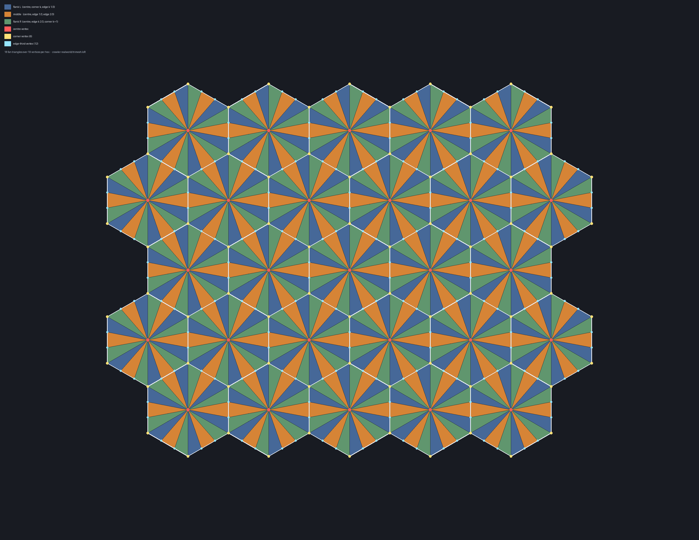
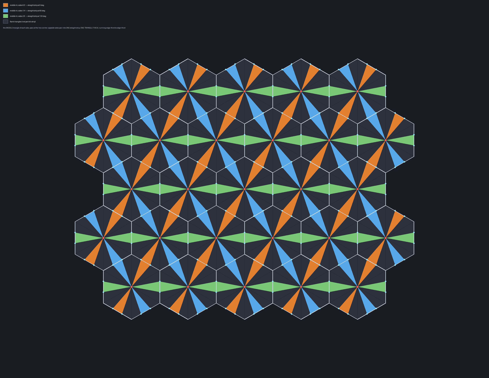
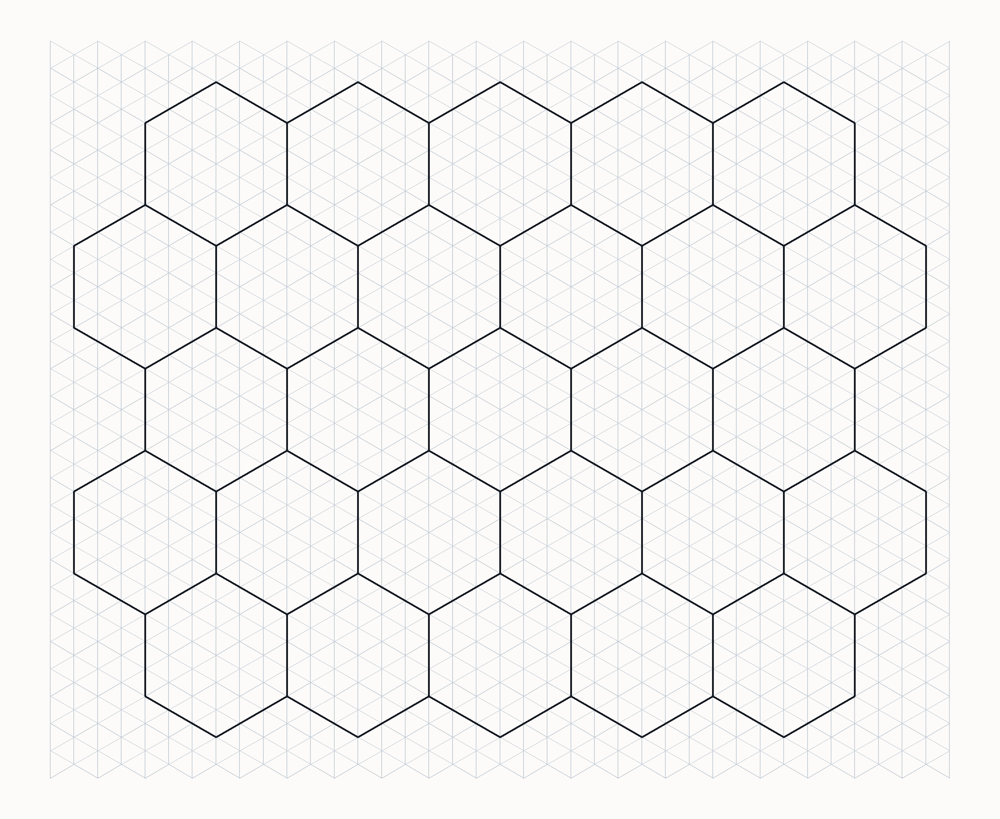
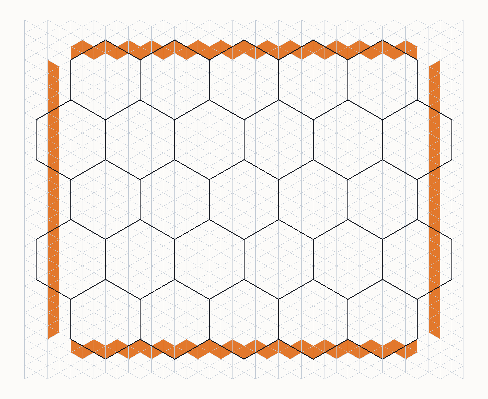
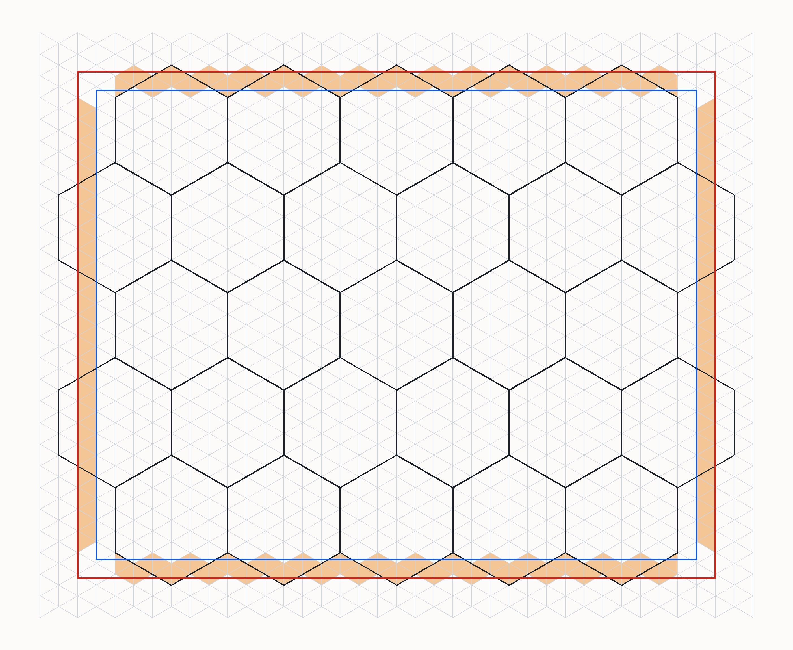

# DESIGN — M0 round trip: what we are building, testing and deciding

The **in-flight** half. [`ROUNDTRIP.md`](../../ROUNDTRIP.md) holds only what is settled —
definitions, the propositions that provably follow, and the constraints `X1`–`X31`
**with their trust tier** (§7: T1 holds `X1`, `X2`, `X19`–`X22`, `X24`–`X31`). **Everything here is a proposal, a hypothesis or
an open question**, and none of it should be cited as fact.

Plan status, phases and ordering: [`README.md`](README.md).

---

## 1. Proposed laws — beyond the settled `D`/`E₂` core

Each is a **design claim**, not a theorem. Notation `A₁ … K₂` is the working numbering.

| # | law | statement | status |
|---|---|---|---|
| **A₁** | canonicity | `∀m. read(write(m)) = m` ∧ `∀T. write(read(T)) = T` | proposed |
| **A₂** | monotone extension | `𝕋ₙ ⊆ 𝕋ₙ₊₁`, and `∀T ∈ 𝕋ₙ`: same model, same field, **same bytes**; `𝕄*` grows, never shrinks (§4) | proposed |
| **B** | projection | `∀m ∈ 𝕄. σ(σ(m)) = σ(m)` ∧ `ρ(σ(m)) = 0` | proposed |
| **C₁** | fitting = fixed point | `∀m ∈ 𝕄. m ∈ 𝕄* ⟺ σ(m) = m` | proposed |
| **C₂** | closure under operations | `∀m ∈ 𝕄*, ∀op ∈ Ops. op(m) ∈ 𝕄*`, `Ops = {flip, place, combine, damage, seat}` (§5) | proposed |
| **D** | round trip | `rebuild(draw(m)) = m` | **the target** |
| **E₁** | totality | `∀f ∈ 𝔽. rebuild(f) ∈ 𝕄*` — never fails, never returns a non-fitting model | proposed |
| **E₂** | exactness on `im(draw)` | `rebuild ∘ draw ∘ rebuild = rebuild`, `ρ = 0` | **the target** |
| **E₃** | approximation off it | `f ∉ im(draw)` → `(m′, ρ)` with `ρ` **reported**; `ρ > 0` expected (§3) | proposed |
| **F** | injectivity | `draw(m₁) = draw(m₂) ⟹ m₁ = m₂` | follows from D; its *coverage* is measured |
| **G** | flip commutation | `rebuild(flip_𝔽(draw(m))) = σ(flip_𝕄(m))` | **pending OD-5** |
| **H** | flip stability | `φ ≔ σ ∘ flip_𝕄`; `φ²ⁿ(m) = m` | **pending OD-5** — may be a theorem, given `X2` |
| **I** | `O`-equivariance | `draw(τ_v ∘ o · m) = τ_v ∘ o · draw(m)` | **GREEN** (`tests/house.loft`) |
| **J** | stencil closure | `Σᵢ lenᵢ·e(hᵢ) = (0,0)` ∧ `Σᵢ turnᵢ = 12` | proposed — **pending OD-6/OD-7** |
| **K₁** | seam containment | error `= 0` in a frame interior; `≤ ε_seam` and deterministic on the seam (§6) | proposed |
| **K₂** | seam arbitration | exact at `κ ≤ 1`; deterministic pairwise at `κ = 2`; conservative + counted at `κ ≥ 3` (§6) | proposed — `X4` is **stronger** |

## 2. Proposed grammar of `𝕄*`

**Now bounded by the foxel schema** (`ROUNDTRIP` §2.4): every production below must draw into
`layer* × point → (height, material, wall1..3, item)` exactly, or it is not admissible. OD-6 and
OD-7 are closed; what remains proposed is the *description* layer, not the storage.

```ebnf
⟨model⟩    ::= { ⟨layer⟩ | ⟨stencil⟩ | ⟨place⟩ | ⟨line⟩ | ⟨join⟩ }
⟨layer⟩    ::= "layer" ⟨nat⟩ { ⟨element⟩ }   (* layer* is the OUTERMOST structure — OD-8 closed *)

(* A · stencil, in a LOCAL frame.  TWO shape primitives — see §10.4, they are different
   families and neither subsumes the other. *)
⟨stencil⟩  ::= "stencil" ⟨name⟩ { ⟨element⟩ }
⟨element⟩  ::= ⟨plan⟩ | ⟨form⟩ | ⟨arc⟩ | ⟨feature⟩ | ⟨roof⟩ | ⟨layer⟩

(* rectangular massing — the house.  Continuous, rasterised centre-in-region; both axes in
   units of s.  A union of these gives L-shapes and wings. *)
⟨plan⟩     ::= "plan" ⟨nat⟩ "at" ⟨point⟩ "wid" ⟨nat⟩ "dep" ⟨nat⟩

(* lattice-native polygon — the hexagonal tower.  A closed turtle cycle, law J. *)
⟨form⟩     ::= "form" ⟨nat⟩ "h0" ⟨h0⟩ { ⟨side⟩ }
⟨side⟩     ::= "side" ⟨nat⟩ "len" ⟨nat⟩ "turn" ⟨turn⟩
⟨h0⟩       ::= ⟨nat⟩                        (* initial heading h ∈ H₁₂ = ℤ/12 *)
⟨turn⟩     ::= ⟨int⟩                        (* Δh ∈ -5..6, twelfths of a revolution *)
⟨arc⟩      ::= "arc"  ⟨nat⟩ "ctr" ⟨point⟩ "rad" ⟨nat⟩ "from" ⟨rat⟩ "to" ⟨rat⟩
⟨feature⟩  ::= ⟨kind⟩ "side" ⟨nat⟩ "t" ⟨rat⟩ "w" ⟨nat⟩ [ "sill" ⟨nat⟩ "head" ⟨nat⟩ ]
                                            (* stored as a MATERIAL on the wall slot — 2.4.1 *)
⟨side⟩ shape ::= "straight" | "rounded"     (* a slot may be rounded — this is how arcs store *)
⟨place⟩    ::= "place" ⟨name⟩ "at" ⟨point⟩ "orient" ⟨orient⟩
⟨orient⟩   ::= ⟨rot⟩ [ "flip" ]             (* o ∈ O — the ONLY choice a placement makes *)
⟨rot⟩      ::= "0" | "1" | "2" | "3" | "4" | "5"

(* B · world linework: drawn in WORLD coordinates, direction follows the run *)
⟨line⟩     ::= "line" ⟨lkind⟩ ⟨nat⟩ "from" ⟨point⟩ "dir" ⟨dir⟩ "len" ⟨nat⟩
⟨join⟩     ::= "join" ⟨nat⟩ ⟨nat⟩ "rad" ⟨nat⟩       (* G¹ arc joining two ⟨line⟩s *)
⟨lkind⟩    ::= "road" | "wall" | "cliff"

(* shared terminals *)
⟨point⟩    ::= ⟨int⟩ "," ⟨int⟩              (* lattice, or half-integer at edge midpoints *)
⟨dir⟩      ::= ⟨int⟩ "," ⟨int⟩              (* reduced; ∈ D — reachable ONLY from ⟨line⟩ *)
⟨rat⟩      ::= ⟨int⟩ "/" ⟨nat⟩              (* reduced; never a decimal *)
⟨int⟩,⟨nat⟩ ::= decimal integer
⟨name⟩,⟨kind⟩ ::= DEFERRED
⟨roof⟩     ::= a HEIGHT per point           (* OD-2 closed: heights are stored, profiles are R2 *)
```

Two intents the grammar is meant to *enforce* rather than assert:

- **`⟨dir⟩` is unreachable from `⟨stencil⟩`** — "a stencil at one of 24 directions" is
  *unparseable*, not merely invalid.
- **There is no `⟨float⟩` production** — a model needing a float is unparseable, so the fitting
  criterion is enforced by the parser.

| quantity | stored as | never stored as |
|---|---|---|
| position | `(q,r) ∈ Λ`, half-integer at edge midpoints | metres |
| direction — **A** | `h ∈ H₁₂`, via `h0` + running `Σ turn` | degrees, or a `⟨dir⟩` |
| direction — **B** | reduced `d ∈ D` | degrees |
| length | **step count** along `e(h)` (A) or `d` (B) | metres |
| radius, sill, head, height | step count | metres |
| parameter along a side | reduced `⟨rat⟩` | decimal |

Metres and degrees are **derived for display**. Lattice lengths are irrational
(`‖(2,1)‖ = 1.5√7 m`), so storing metres would forfeit exactness.

## 3. Canonical text `𝕋`, and damage

Proposed rules — a model has **exactly one** spelling:

1. **C1 integers only** — every numeric token is `⟨int⟩`, `⟨nat⟩` or reduced `⟨rat⟩`.
2. **C2 fixed order** — elements sorted by `(kind, index, t)`; fields in declaration order.
   **`kind` orders by a fixed registry position, never alphabetically** — new kinds are appended
   (§4).
3. **C3 reduced forms** — `⟨dir⟩` and `⟨rat⟩` in lowest terms.
4. **C4 fixed layout** — single space separators, one element per line, no trailing space.
5. **C5 defaults are omitted** — an optional field is written only when it differs from its
   default, and the default reproduces prior behaviour exactly (§4).

*Illustrative only — the rules are the proposal, not the token spellings:*

```
stencil house1  h0 0
side  0  len 4  turn 3
side  1  len 5  turn 3
side  2  len 4  turn 3
side  3  len 5  turn 3
door  side 3  t 1/2  w 1
win   side 3  t 1/5  w 1  sill 2  head 5
place house1  at 3,-2  orient 4 flip

line  road 0  from 0,0    dir 2,1  len 40
line  road 1  from 31,18  dir 1,1  len 25
join  0 1  rad 6
```

Law **J** on that stencil: `Σ turn = 12` ✓, and `4·e(0) + 5·e(3) + 4·e(6) + 5·e(9) = (0,0)` ✓
since `e(h+6) = −e(h)`.

### 3.1 What is stored — settled by the foxel schema

| | stored? | role |
|---|---|---|
| `𝕋` — a body's **original** | **yes** | the truth for that body, in its local frame |
| `P` — its **pose** | **yes** | where it is in the world; free of the lattice |
| `𝔽_loc` — its local field | **no** — `draw(original)`, on demand | what collision, render and destruction read |
| `𝔽_wld` — terrain + linework | **yes** | the world's own truth |

This scopes `SPEC` **L3** rather than weakening it: *"the field is the stored truth"* holds for
the **world**; a **body**'s truth is its original plus its pose. **OD-6 is closed by the schema**
(`ROUNDTRIP` §2.4): whatever is stored, the model may only express what the foxel can hold, so
`𝕋` and the field describe the *same* admissible set.

### 3.2 Damage — the one place the original is lost

Destruction mutates `𝔽_loc` directly. The original no longer describes the body and is **not
recoverable** — a ruin is not an invertible transform of a house. So the damaged field is
**re-canonicalised to a new original, by approximation**:

```
𝔽_loc ──mutate──▶ 𝔽′ ──rebuild──▶ (m′, ρ) ──write──▶ 𝕋′       ρ > 0 is EXPECTED and REPORTED
```

`𝕋′` becomes the stored original from that moment; the pre-damage `𝕋` is history, not a second
truth. **This is the only step where `ρ > 0` is legitimate**, and it is legitimate precisely
because it produces a *new original* rather than pretending to recover the old one — which is why
law **E** splits into `E₁`/`E₂`/`E₃`.

## 4. Growing the language — proposed extension contract

This is infrastructure built out **like a programming language**: `⟨tower⟩`, `⟨bridge⟩`, `⟨prop⟩`
and new parameters get added over years. Adding a keyword must never change a program already
written — law **A₂**.

| adding | the trap | the rule that prevents it |
|---|---|---|
| a **verb** (`⟨tower⟩`) | sorting `kind` alphabetically makes it interleave, **re-spelling every existing text** | **C2** — registry order, appended |
| a **parameter** | writing it always adds a token to every existing element | **C5** — omitted at default |

A re-spelling is not cosmetic: `𝕋` **is** the stored truth for a body (§3.1), so it would
invalidate every stored original and every fixture at once.

> **The census window.** Restrictions can be added to `fits?` **freely while phase A runs and
> nothing has been authored against it**. Once texts exist in the wild, tightening `fits?` is a
> **breaking change** with no migration — nobody can re-derive geometry a person hand-placed. Run
> the whole ladder, **A8 included**, before the editor ships content.

### 4.1 Worked example — adding `octagon` to the slot shape vocabulary

*"There will be octagon wall types too, for octagonal towers and bay-windows — but that is an
example of how we extend our grammar."* It is the **cheapest** shape of extension, and worth
walking because it shows both what A₂ protects and what it does not.

**A new value in an existing vocabulary**, not a new production: `straight | rounded | octagon`.
It serves two scales at once — an octagonal tower and a bay window are the same chamfer.

| A₂ obligation | why `octagon` satisfies it |
|---|---|
| **C2** kind ordering | a *shape value* is not a new element kind, so nothing re-sorts |
| **C5** defaults omitted | `straight` is the default and is written nowhere, so no existing text gains a token |
| bytes unchanged | existing texts contain no shape token at all → **byte-identical**, trivially |
| `𝕄*` grows, never shrinks | it only admits more; nothing already authorable is withdrawn |

> **But A₂ is not sufficient — and this is the rule the example exposes.** A₂ protects the *text*
> layer. It says nothing about **law F**, injectivity. A newly admitted form can **collide with an
> existing one**: at small sizes an `octagon` run and a `rounded` run may rasterise to the same
> cells, and then `rebuild` cannot tell which was authored, even though every existing text still
> has identical bytes.
>
> **So every vocabulary extension re-opens the census** over the enlarged space — and when a new
> form collides with an admitted one, it is **the new form that is refused**, never the old.
> `𝕄*`-grows-never-shrinks decides the tie: the old form may already have content depending on
> it, the new one cannot.

This gives the extension procedure, in order: add the value → re-run `rt_census_a` over the
enlarged space → refuse whatever new form collides → confirm `rt_extend` still byte-matches every
prior fixture. Three of those four steps are gates that already exist.

## 5. `fits?`, and the doorstep

```
fits?(m)  ⟺  syn(m) ∧ sem(m)
```

| layer | statement | decided by |
|---|---|---|
| **syn** | derivable from the §2 grammar | the parser |
| **sem·A** | *(stencil)* the boundary **cycle** is closed (law **J**) and **unique** among admitted stencils | the stencil census |
| **sem·B** | *(linework)* — **note `X3`**: representability is settled, so this is a *cost* bound, not a threshold | the linework census |
| **sem·C** | *(arcs, joins)* `(rad, span) ∈ Sep`, `G¹` at joins | `Sep` · `junction_g0` |

### 5.1 The two recovery mechanisms differ, and must stay different

|  | **A · stencil** | **B · linework** |
|---|---|---|
| matched object | the **whole closed boundary cycle** | an **open run** |
| direction set | `H₁₂` | `D` — 24 |
| span length | **short spans permitted** | long by nature |
| recovery | **exact match against the enumerated cycle set** | direction recovery |
| injectivity proved by | **exhaustive enumeration** per level, to the discovered frontier | a cost bound |

**Why stencils need no length bound.** An isolated 1-step span cannot fix its heading — one hex
edge lies on one of **3 axes**, which cannot distinguish **12** headings. But a stencil side is
never isolated: by `SPEC` **I3** a wall is the boundary of a *filled region*, so the matched
object is the **closed cycle**, whose corners carry the turn sequence that disambiguates the
short sides. *(This argument depends on **I3**, hence on **OD-7**.)*

### 5.2 The limit sits at the doorstep

**The bounds are not the problem** — there is room inside them, and a restriction found by the
census is a **fact to record**, not a defect to engineer away. What matters is that nothing
outside `𝕄*` gets in.

> **The editor refuses at authoring time.** Not a warning, not a downstream check, not a failure
> at `rebuild`. If a thing cannot survive, it cannot be made. `authorable ⊆ { m : fits?(m) }`.

Deferred breakage separates symptom from cause: a building authored on Monday looks right,
round-trips right, and breaks after a flip / beside its neighbour / once damaged, with nothing on
screen pointing back at the authoring choice. **"Eventually broken" is why law C₂ exists**:

| `op ∈ Ops` | the deferred break it would otherwise cause |
|---|---|
| `flip` | authored fine, wrong after a mirrored placement |
| `place` | fine in the local frame, wrong once seated |
| `combine` | fine alone, broken beside its neighbour — rung **A8**, the least visible axis |
| `damage` | fine intact, un-re-canonicalisable as a ruin |
| `seat` | fine on flat ground, unseatable on real terrain |

There are exactly **two doors** into `𝕄*`, and both are guarded: the **editor** (`fits?`) and
**`rebuild`** (lands in `𝕄*` by `E₁`). A refusal **names its restriction** and offers the nearest
fitting alternative with its residual — never a silent snap, never a blank rejection.

*Prior art:* `X5` — *"a stencil rotated by a non-multiple of 60° must be refused, not silently
rounded"* — is this principle, pre-dating it, generalised here from rotation to all of `Ops`.

## 6. Frames, the seam, and contention

Collision reads **several presentations at once**: the unmovable base world plus every posed body.
Each belongs to one **frame** — `Φ_wld` (identity) or `Φ_b` (the body's pose). Inside a frame
geometry is exact; **across frames it cannot be**, because a pose is continuous. Where two frames'
geometry meets there are **cracks** — the **seam** `Σ`.

**Enforced by construction, not discipline.** Every cross-frame query routes through one path:

```
  world query ──[ p⁻¹ ]──▶ local query ──exact test in 𝔽_loc──▶ hit ──[ p ]──▶ world
                    └────────── the ONLY inexact step ──────────┘
```

The pose transform is the sole floating-point step *and* is already the `I5` chokepoint, so `Σ` is
where error lives because it is the only place a transform happens.

**Forbidden fix:** closing a crack by *moving geometry* — snapping a body's wall onto the world
lattice. That relocates seam error into a frame **interior** and voids **D** for that body.

**Jank is not licence for nondeterminism.** `L7`/`I9` need byte-identical replay, so seam error
must be a deterministic function of its inputs. A crack that differs between two runs of the same
derailment is a defect, not an allowed imprecision.

### 6.1 Contention

Two kinds of disagreement, handled differently:

| kind | example | handling |
|---|---|---|
| **numerical** | a contact point computed in `Φ_a` vs `Φ_b` | **removed by construction** — compute cross-frame quantities in **one designated frame**, single-valued because only one computation happens |
| **categorical** | world says *gap*, body says *solid* | arbitration, by contention degree `κ` |

| `κ` | regime | requirement |
|---|---|---|
| `≤ 1` | no contention | **exact** |
| `= 2` | **the designed-for case** | deterministic pairwise arbitration over a total order on frames |
| `≥ 3` | rare | total, deterministic, **conservative** — and **counted** |

Two requirements that are easy to omit silently: a **total order on frames** (a "whichever is
nearer" tie-break resolved by iteration order breaks replay), and a **fail-safe direction** —
prefer *solid* over *gap*, which composes with `I4` so a crack yields a spurious contact rather
than a body falling through the world.

> **`X4` is stronger than K₂ and should probably replace it.** crawler requires overlapping
> stencils arbitrate *"deterministically **and order-freely**"* — order-free means the result does
> not depend on order at all, not merely on a fixed one. Its **level separation** also does work
> `κ` would otherwise have to: two objects on different levels never contend.

> **`κ ≥ 3` is a counter, not an assumption**, and the scene that maximises it is **`G★` itself**
> — a pile of tumbled wagons is many overlapping frames. A point query rarely finds 3 at once; a
> **swept volume** straddles frames far more easily. Measure it there, not in a two-body fixture.

## 7. Open constants

| constant | domain | produced by | status |
|---|---|---|---|
| `Cyc` | A | the stencil census, grown by level (§8) | **OPEN** |
| `period` | B | the linework census | **MEASURED + SETTLED** ✅ — a **three-class** table: 6 directions at `√3` wu, 6 at `1` wu (both exact in angle), 12 in-between at `√39` wu = **5.408 m**, `1.1021°` off nominal and `δ = 0` (they link unconditionally). `X3` was right that the question was **cost**, not representability; the in-between vector was switched from `N = 21` to `N = 39` on the strength of it (`X56`, `tests/censusb.loft`) |
| `Sep` | B | the arc sweep | **OPEN** — and aimed at a different objective than `X7`'s collision-match |
| `D` | B | — | **CLOSED** — all 24 representable (`X3`) |
| `ε_seam` | frames | measured at the chokepoint | **MEASURED** ✅ — the pose round-trip residual is **≈ 7.1e-15 (machine ε)**; a routed query agrees with an exact integer oracle on all 1681 grid points (`X53`, `tests/seam.loft`) |
| `κ≥3` rate | frames | `rt_contend`, in the `G★` pile | **MEASURED** ✅ — **rare at a point** (10 of 841), but a **swept** segment touches 4 frames where no point sees 3; κ≥3 is a counter, measured on sweeps (`X53`) |

## 8. Method — grow, don't presuppose

**Do not define the admitted space and then enumerate it.** That presupposes the bounds, and the
bounds *are* the answer. The restrictions are the **output**.

```
  level n:  enumerate EXHAUSTIVELY at this level ──▶ round-trip each ──▶ all pass?
                          ▲                                              │  yes → n+1
                          └──────────────────────────────────────────────┘
                                       the failing pair IS a restriction ─┘  no
```

Within the frontier law **F** is *decided*, not sampled — the growth loop sits **outside** the
enumeration, not instead of it. Every level is a complete gated increment, so the work always has
something green rather than one long red run to a verdict.

**Two growth axes**, and the second is where the discoveries are: **form** (minimal cycle → longer
sides → more sides → unequal → non-convex → features → arcs) and **combination** (two stencils
adjacent, stencil against linework, stencil on terrain). Things that round-trip alone routinely
stop round-tripping combined.

**The smallest form is concrete.** By law **J** a stencil needs `Σ turn = 12` and a closing vector
sum, so the minimum is **3 sides** — an equilateral triangle, `turn 4` at each corner, closing
because three lattice vectors 120° apart sum to zero: `(1,0) + (−1,1) + (0,−1) = (0,0)`.

> **Method warning `X9`, earned in crawler.** *"Before width-normalising, this table appeared to
> show the VERTEX directions as the worst of all. That was an artefact — a fixed nominal halfwidth
> yields 17/29/19 cells by direction, so the raw spread was measuring width, not heading. Fitting
> `W` per direction **reversed the conclusion**."* The census has the identical hazard: forms at
> different headings enclose different cell counts, so raw spread conflates **size** with
> **heading**. A census that skips this produces a confident, ranked, **inverted** table.

### 8.0 The corpus — what the ladder actually produces

Each rung's enumeration is not thrown away. **The entries are the deliverable**, kept permanently,
and they accumulate into hexbody's own **T1** tier (`ROUNDTRIP` §7.1) — the thing almost no
inherited prior art gives us.

Shape of an entry, one per admitted form:

```
corpus/<rung>/<case>.t          the canonical text T          — the authored truth
corpus/<rung>/<case>.f          draw(read(T)), or its digest  — what it rasterises to
```

and the gate over the whole corpus is one line, by **P3**/**P4**:

```
for every entry:   write(rebuild(draw(read(T))))  ==  T        byte-for-byte
for every pair:    f(a) != f(b)                                law F, injectivity
```

**Why this is affordable exhaustively.** No golden images, no tolerance, no per-case judgement —
the check is `diff`. That is the practical payoff of keeping `𝕋` float-free (**C1**), and it is
why the ladder can enumerate a level *completely* instead of sampling it.

**Where the corpus lives, and where it does not.** These inputs are **stored for testing only**.
The editor does not store `𝕋` — it writes layer 1, the foxel (`ROUNDTRIP` §2.4.2), and `𝕋` is
explicitly not a second editor representation. The corpus is a *test* artifact; nothing at runtime
reads it.

**Why the entries are kept rather than regenerated.** `rt_extend` replays every prior entry after
any grammar change and demands byte-identical output (law **A₂**). Regenerating them would make
that gate vacuous — it would compare new output against new output and always pass. **A corpus
that regenerates is a gate that cannot fire.**

**A rung is done when** its level is exhaustively enumerated, every entry round-trips, no two
entries collide, and any restriction found is enforceable at the door (§5.2).

### 8.0.1 Where two forms touch — the hardest part of distinguishability

Rung **A8** is not just "more cases". Two forms **touching** is where distinguishability is
genuinely hard, and it is where crawler has made its biggest inroad — `FORMS.md`, *"a kit of
exact, interlocking hex parts (no seams by construction)"*, which owns *"the seam-exactness
property — no gap, no angle — and the matcher."*

Its acceptance criterion is stated as the user's own test:

> *a composite of stitched parts reads as **one continuous structure**, never a chain of joints —
> **no visible gap** (position) **and no visible angle / kink** (direction) at any seam, except
> where an angle is intended.*

**FORMS also argues our R1/R2 split from the other side**, independently, which is worth noting as
convergence rather than coincidence: trig-and-round-to-hex *"draws fine"*, but leaves **no exact,
enumerable form**, so the matcher *"would be reverse-engineering an approximation"*. Its answer —
an **exact predefined cell-form is the source of truth (matchable)**, with trig still rendering it
smoothly downstream — is `R1` reached from the matcher's end instead of the round trip's.

**Status: T3.** `FORMS.md` says of itself *"DESIGN SESSION — requirements only. No implementation,
no geometry pinned yet."* So it is **input, not authority** — usable, and to be **revalidated
against our own corpus inputs** before anything rests on it.

#### The tension it exposes, which is new

**Seam exactness and distinguishability pull against each other.** FORMS wants a composite to read
as *one continuous structure*. Law **F** wants two distinct models to draw to *distinct fields*.
The better the seam, the more nearly a composite of A and B is field-identical to some single form
C — and then `rebuild` cannot recover which was authored.

| property | what it wants | where it lives |
|---|---|---|
| **seam exactness** | parts merge with no gap (`G⁰`) and no kink (`G¹`) | a *construction* property — FORMS |
| **distinguishability** | distinct models → distinct fields | an *injectivity* property — law **F** |

**Likely resolution — needs confirming at A8, not assuming now.** The two are only in conflict if
part identity has to survive in the *fabric*, and it does not:

- **Seated fabric may merge.** Two adjacent seated stencils genuinely *become* one fabric, and
  that is correct — `rebuild` returns a **canonical representative** (P1: `𝕄* = im(rebuild)`), not
  the authoring history. Which of several field-identical models was authored is not recoverable
  and does not need to be.
- **Identity lives elsewhere** — in the placement records and the mechanism graph (§10.3), neither
  of which is fabric. A wagon coupled to a car is two bodies because they are two *frames*, not
  because their fields differ.
- **Free-posed bodies never share a field at all** (`ROUNDTRIP` §2.3), so the question does not
  arise for them.

**What must still not collide,** and this is A8's real gate: two composites that need to
*behave differently in the fabric* — different passability, different destruction fragmentation,
different material — must not be field-identical. That is a narrower and checkable claim than
"all composites are distinguishable", which is false and should not be attempted.

### 8.1 The rungs come from the scene, not the desk

§8 is the method; it is not the work-list. The current work — **a landscape with houses, trees and
a tower** — decides which rungs exist and in what order. It is not a demo of the infrastructure;
it is the **instrument that finds the infrastructure's gaps**. A contract makes the axes you
already see safe; only a real scene converts an axis nobody imagined into one you can gate.

| the scene has | it exercises | consequence |
|---|---|---|
| **houses** | polygonal stencils, features, `H₁₂` | the ladder's spine |
| **a tower** | **arcs**, immediately with features — the **doored-tower defect** (`design/FEATURES.md` §3): a wall with a door fitting **3 arcs instead of 1** | arcs move from the last rung to the middle; the defect is a named law **D** failure |
| **trees** | a class with **no verb** | **OD-3** |
| **the landscape** | terrain with **no production**, plus seating | **OD-4** — the *seating* half is now CLOSED (`X59`): seating writes the `height` slot, so terrain and stencil are orthogonal and the round trip is untouched; the residual is returned and flagged. Terrain *generation* remains unbuilt (crawler's plan #8 is *"Future — nothing built"*), but it is a **producer**, not a round-trip question |

## 9. Proposed gates

| gate | law | test | control |
|---|---|---|---|
| `rt_canon` | A₁ | text diff | reorder a field → diff |
| `rt_extend` | A₂ | replay every prior fixture; bytes **identical** | sort `kind` alphabetically → later verbs re-spell every text |
| `rt_project` | B | equality + `ρ = 0` | perturb by ½ step → `ρ ≠ 0` |
| `rt_fits` | C₁ | `fits?` vs `σ(m) = m` | a cycle in the collision set → `fits?` false |
| `rt_closure` | C₂ | `∀m, ∀op ∈ Ops. fits?(op(m))` | admit a form whose `flip` leaves `𝕄*` → fires at the door |
| `rt_door` | C₂ | every editor op yields `fits?`; refusals name their restriction | let the editor emit a non-fitting model → `rt_trip` breaks downstream instead |
| **`rt_trip`** | **D** | **`write(rebuild(draw(read(T)))) ≟ T`** | a non-fitting model bypassing `σ` → diff |
| `rt_total` | E₁ | `σ(rebuild(f)) = rebuild(f)` for arbitrary `f` | hand-corrupt an `EdgeSet` → still lands in `𝕄*` |
| `rt_ruin` | E₂,E₃ | `ρ = 0` on `im(draw)`; reported off it | crumble a wall → `ρ > 0` surfaced, not swallowed |
| `rt_census_a` | F | grown by level; **reports the frontier** | remove a corner's turn from the match key → collisions at level 1 |
| `rt_census_b` ✅ | F | the domain-B cost table — **landed as `tests/censusb.loft` (`X56`)**: three period classes (6/6/12), the even/odd angle split, and the `X31` ladder anchored to the gated direction 1 | *(it had none — now it has two)* a genuine **trade** must exist among the candidates, or "dominated" is empty; and the measured period must not match `√N/3`, or §10.10's `3.969 m` would be the wrong number |
| `rt_close` | J | `Σ lenᵢ·e(hᵢ) = 0` ∧ `Σ turnᵢ = 12` | drop one turn → non-zero sum |
| `rt_seam` ✅ | K₁ | error `≡ 0` in interiors; `≤ ε_seam` on `Σ` — **landed as `tests/seam.loft` §1–§2 (`X53`)**: `ε_seam ≈ 7.1e-15`, 0 disagreements vs an exact oracle | "fix" a crack by snapping a body wall → interior error ≠ 0 (**fires**: 12 cells) |
| `rt_contend` ✅ | K₂ | `κ` histogram over the `G★` pile — **landed as `tests/seam.loft` §3–§4 (`X53`)**: κ≥3 rare at a point, worse on a sweep; arbitration order-free + fail-safe | tie-break on iteration order → replay diverges (**fires**: 2 vs 5); a world-blind counter undercounts |
| `rt_flip` ✅ | G | text diff — **landed as `tests/flip.loft` (`X57`)**, at the FIELD level rather than the text: linework is closed under the 12 orientations, and a wall segment's mirror **reverses traversal** (`d → −d` at the mirrored far end). 96/96 mirror cases exact, 48 of them in-between | the naive `d → 12−d` at the mirrored start must **fail**, on exactly the 2 directions the mirror fixes (90°/270°) — **fires**. ⚠ `N=1` rotation is an open anomaly, pinned at 18 cases |
| `rt_drift` | H | text diff after `φ¹²` | inject a rounding step → drift |
| `rt_orient` | I | field equality over `O × Λ` | **GREEN over HOUSES ONLY** — `tests/house.loft`, 12/12 in cells and edges. A house is drawn by `draw_walls` (the exact combinatorial boundary of a filled region); **world linework goes through `wall_write` and is a different path**, gated separately by `rt_flip` (`X57`). Reading this row as covering linework is the mistake it caused once |

`rt_trip` must be **enumeration-driven** over primitive kinds — a new primitive without
`write`/`draw`/`rebuild` coverage fails the gate rather than going silently ungated.

## 10. Open decisions

> **Status: 7 of 10 closed.** Open: **OD-1** (the morph — narrowed to *probably unnecessary*),
> **OD-5** (is the flip exact — `X2` says yes, but at T2), **OD-10** (arc parameters from rounded
> slots). Plus one unnumbered fork: **how an anchor is addressed** (§10.3.1).
>
> **The foxel schema (`ROUNDTRIP` §2.4) closed or narrowed most of what follows.** Recorded here
> so the reasoning survives, with the schema's consequence marked on each. **What the schema
> states is settled; the per-decision consequences below are inference and want one confirmation
> pass.**
>
> | | was | after the schema |
> |---|---|---|
> | **OD-2** roofs | in or out of the exact round trip? | **`height`.** Heights are the stored truth; a roof *profile* is a **R2** fit over them, so `roof_match`'s `tol` is legitimate — in R2 |
> | **OD-3** trees | a verb, or a prop outside `𝕄*`? | **`item`** — confirmed in code (`ItemDef.id_kind = TREE`, `X13`). And the class **splits by scale**: ≥ 1 hex step → `h_item`; < 1 hex step → **set dressing, outside `𝕄*`** (`ROUNDTRIP` §2.4.0.1) |
> | **OD-4** terrain | a `⟨terrain⟩` production? | **`height`.** Same slot as roofs — the two were always one question |
> | **OD-6** stencil: field or description? | the deepest one | **the foxel is the stored truth.** A description is admissible only if it draws into the schema exactly |
> | **OD-7** which wall model? | edges vs triangle band | **`wall1..3` per point — edges.** A triangle subdivision needs sub-cell resolution the schema has no slot for. `WALLS.md`'s band model cannot be *stored*, whatever its merits as a render/collision construction |
> | **OD-8** when do layers enter? | deferred | **now.** `layer*` is the outermost structure |
>
> **What survives as genuinely open:** **OD-1** (the morph — unaffected, it was already narrowed
> to option (c) by free poses) and **OD-5** (is the flip exact — `X2` says yes; unaffected by the
> schema). And a new one below.
>
> **OD-9 · does the door survive as an annotation? — CLOSED.** *"Doors and windows are materials
> on the wall slot."* The edge is never removed, so the anti-deletion rule holds and the
> doored-tower defect cannot arise — but a door **is** the material rather than an annotation
> beside one. Composition therefore lives in the **material vocabulary** ("door in a stone wall" is
> a material), and the table grows with wall-kinds × feature-kinds. See `ROUNDTRIP` §2.4.1.
>
> **OD-10 · arcs are storable — what is recoverable from them? — ✅ RESOLVED (§10.26).** A round
> tower needs no sub-cell geometry: a run of slots marked **rounded** is the arc. The parameter
> question is answered **split**: the **centre is exact** (it is the translation, and the field pins
> it), the **radius is not** — it quantises to *shells*, the realisable values of `3k²+m²`. So an
> arc is **R1 on a quantised parameter grid**, which is `Sep` made concrete.

> **OD-12 · which edges IS a wall? — ✅ RESOLVED (§10.12).** The three-slot foxel can only store
> hex edges, and a hex has edges on **three lines only — 30°, 90°, 150°** (`X28`). So "the wall" is
> a **connected chain** of edges lying *along* the line, an alternating wobble for any other
> heading. The first `wall_write` selected the edges the band **crossed** (the perpendicular ones),
> giving a comb of pickets. **The fix: mark the edges that SEPARATE the wall's two sides** — the
> boundary between two half-planes, which is one connected chain along the line. Gated by
> `tests/wall.loft` §6 (every wall is one chain: two ends, no branch), with the picket comb as the
> control it is measured against.

**OD-1 · the morph — dead, or moved into `snap`?**
`design/EDITOR.md` §2 makes orientation a *minimal affine morph*, *"the bridge from 6 exact
rotations to **many**."* A morph is a **non-lattice affine map**, so a morphed wall lands outside
`𝕄*` and no exact round trip exists for it. EDITOR §2 names the second break itself — *"a general
two-axis morph turns a circular arc into an ellipse"*.

Free poses narrow this sharply: a building at 37° is simply a **free-posed body**, exact in its
own frame. The morph is needed **only** for a **seated** body that must share lattice cells.

| option | consequence |
|---|---|
| **(c)** unnecessary *(cheapest)* | open question shrinks to: does a *seated* building ever need an angle outside the 12? Only if a walker crosses street↔interior on shared cells at that angle |
| **(a)** superseded | EDITOR §2 deleted; free poses cover the rest |
| **(b)** into `snap` | a lossy seating convenience with residual `ρ`, never stored; `𝕄*` and **D** untouched |

**OD-2 · are roofs inside the exact round trip?**
`Heights` is neither domain A nor B: a roof is a continuous surface sampled into a height field
(`hexroof`: cone, ridge, vault, hip, dome, groin, cloister). The tree already implements recovery
*with a tolerance* — `roof_match(s, f, tol: float)` (`src/hexroof.loft:493`), which is the `ε`
**P4** forbids. Options: **(a)** roofs excluded — `𝕋` carries roof *parameters* and `Heights` is a
derived render product never recovered; **(b)** roofs are a **domain C** with an exact inverse per
profile.

**OD-3 · are trees in `𝕄*` at all?**
The scene has trees; the grammar has no verb. Either an **instanced prop** (pose + kit piece,
never round-tripped — cheaper, matches VISION's kitbashing route) or **field geometry** (a canopy
occupying cells, which makes a tree *fellable* and its stump derivable). **Do not decide from
here** — crawler holds `plans/9-canopy-trees/TREES.md` plus `src/canopy*.loft`, and `PROPS.md`.

**OD-4 · is terrain inside the exact round trip?**
No `⟨terrain⟩` production. Structurally identical to OD-2, so answer them together. Prior art:
crawler `plans/8-landform-morphogenesis/`.

---

**OD-13 ✅ RESOLVED (one run per stencil) · the in-between 12 are FIRST CLASS** *(contradicts `ROUNDTRIP` §2.2 — and this is a
stated requirement, not a question about whether it is wanted)*

> *"the normal 12 directions are fine but a city/castle needs more directions to be believable so
> the other 12 need to be first class"* — user, 2026-07-24.

`ROUNDTRIP` §2.2 currently says the opposite in as many words: *"**`D` is never an authoring
palette.** A stencil is placed at one of the 12 `o ∈ O`, never at one of the 24. A road is never a
stencil: it is drawn where it runs."* That sentence is what has to move, and `ROUNDTRIP` is the
settled core, so it moves only once the replacement is built rather than asserted.

**The geometry is already ready** — that half is done and gated:

| | |
|---|---|
| the 24 directions are closed under the 12 orientations | `X57`, 0/24 on all three closure checks |
| a wall segment mirrors exactly, in-between included | `X57`, 96/96 (48 in-between) |
| the in-between angle error, after the `N = 39` switch | `1.1021°` (`X56`), 3.7× better than before |
| in-between runs link to the house angles unconditionally | `δ = 0` (`X56`) |

### The invariant, and the one site where omission is SILENT

The pattern that carried `X51`/`X58`/`X59` says where to put an embedded wall:

> **An embedded wall is a MATERIAL ON INTERIOR EDGES** — edges whose *two* cells are both in the
> footprint. The footprint **cells** are untouched, so form recovery (the convex hull of the filled
> cells, `X45`) is unperturbed; the wall is recovered by a **separate pass reading exactly those
> interior edges**. The two recoveries read **disjoint slots**.

An *interior* edge (both cells in) is geometrically distinguishable from a *boundary* edge (one cell
in, one out) with no extra tagging, so the split needs no new storage — only the discipline of never
letting an embedded wall change the fill.

**Four re-assertion sites, and their failure modes are not equal:**

| site | must | if omitted |
|---|---|---|
| `draw` | mark interior edges, never change cells | loud — the footprint moves and form recovery breaks |
| **`rebuild`** | read interior edges as a **separate pass** | **SILENT — the wall is simply dropped** |
| `write`/`read` | carry the embedded wall in the text | loud — a text diff |
| `fits?` | refuse an off-grid anchor/length (`X56`) | silent — snapped, per `X50` |

**`rebuild` is the dangerous one.** Today it returns the turtle form alone, so an embedded wall would
vanish and **`rt_trip` would still pass** — the round trip would report success on a model missing
half its content. So the extension is not done when the wall draws; it is done when **dropping the
wall makes `rt_trip` fail**, and a control proves it would.

**What is missing is permission and round-trip, not geometry.** To make them first class:

1. **the grammar** — a stencil is footprint-only today (`stencil / side len turn`); it needs a
   production for embedded linework in its **local** frame;
2. **`draw`** — render it;
3. **`rebuild`** — recover it. Today `rebuild` returns the turtle form alone, so embedded linework
   would be silently dropped and `rt_trip` would not even notice;
4. **`fits?`** — refuse off-grid anchors and lengths at the doorstep, per `X56`'s quantisation.

**Not verified at all: roads.** `X57` tested *walls*. `hexway`'s `Track` is a float world-space curve
with no lattice anchoring, so a stencil-local road raises anchoring and recovery questions walls do
not. Treat "stencils carry roads" as unexamined.

**One thing that WAS open here is now closed:** the `N = 1` rotation anomaly (`X57`) was a real
defect in `wall_separates` — a float sign test on a mathematically-zero offset, under a comment that
wrongly claimed the case could not arise. Fixed; rotation is exact for all three families. It mattered
for exactly this rung: those are the 30/90/150° *house* angles, and a castle drawing them as
**linework** rather than as a house footprint is precisely what would have met it.

---

The four below are **conflicts with settled prior art**, surfaced by inspecting crawler against
this design. Each has a position already argued somewhere. **OD-6 is the deepest and probably
orders the rest.**

**OD-5 · is the flip exact?** *(contradicts `X2`)* — **ALL BUT CLOSED: yes, it is exact.**
Laws **G**/**H** treat the flip as *mutating by approximation*, with `rt_drift` built to measure
drift, and `SPEC` **L4** superseded on that basis. But `X2` says reflection is `k → −k`, **exact**
— so `flip∘flip = id` by construction, `rt_drift` is trivially green, and **H** is a theorem.

**`X57` now measures this rather than inferring it**, and on the harder object: a **wall segment**,
through `wall_write`'s band rasteriser rather than the exact combinatorial boundary. 96/96 cases
mirror exactly, in-between directions included, with no tolerance anywhere. So the *geometric* flip
is settled.

Three things are conflated under "the flip", and separating them dissolves this: the
**lattice reflection** (exact — `X2`, and now `X57` at the field level); the **morph** (genuinely
approximate — OD-1); and the **handedness residual** (backwards text, hinges on the wrong side — a
*content* problem, and the reason EDITOR wants no mirror at all). Only the last two remain, and
neither is "the flip".

**One caveat, and it is a rule rather than an approximation:** a wall is an **undirected segment**,
so its mirror **reverses traversal** — `mirror(wall(d,A,p)) = wall(−d, mirror(farend), p)`. Getting
that wrong is not drift, it is a different wall; and only the two directions the mirror *fixes*
(90°, 270°) expose the error.

**OD-6 · is a stencil a *field* or a *generative description*?** *(the foundational one)*

| | crawler — stencil-as-field | here — stencil-as-description |
|---|---|---|
| the object | `(extent, HexSet, Labels?, Heights?, EdgeSet?, Features?, props?)` — *"a small **field**, not a bitmap"* | a **turtle polygon** |
| stored | the field itself | the canonical text `𝕋` |
| round trip | stamp → un-stamp restores `𝔽` **bit-for-bit** | `write(rebuild(draw(read(T)))) = T` |
| gives you | placement and removal, exactly | **parametric editing** — change a length, re-derive |
| recovery needed? | no — nothing was ever lost | yes — the whole contract |

Both can coexist (a description that *generates* a field which is then stamped), but the spec must
say which is the **stored truth** — §3.1 answers `𝕋`, crawler answers the field. It also decides
how much of **D**/**E₂** is load-bearing: if the field is stored, `rebuild` is only needed for
**R2**.

**OD-7 · which wall model?** *(contradicts `SPEC` I3; `X10` is validated)*

| | `SPEC` **I3** — boundary of a filled region | crawler `WALLS.md` — triangle-subdivision band |
|---|---|---|
| storage | `EdgeSet` — edges between in-cell and out-cell | triangles: each hex edge = **3 sub-segments** |
| thickness | none — a wall is an edge | **free**, one triangle → two hexes |
| interior walls | not expressible | *"just more wall-bands inside the footprint"* |
| 24 directions | needs the fit | *"straight + sharp + 24-direction **for free**"* |
| a door | **annotates**, never deletes (`FEATURES.md`) | *"**remove** a span of the band's triangles"* |
| status | shipping in `housedraw`, gated | validated in 2D, corner tests pass (`X10`) |

The door row is a **direct contradiction** between `design/FEATURES.md` and `WALLS.md`. It may
dissolve — deleting an *edge* fragments a run (the doored-tower defect), while deleting *band
triangles* need not, because a band is not a run — but the spec cannot hold both. This decides
rungs **A5/A7**, the `⟨side⟩` production, and whether `𝕄*` needs a thickness parameter at all.

**OD-8 · when do layers enter?**
`⟨layer⟩` is DEFERRED here. crawler `STENCILS.md`: stencils are *"multi-layer — a vertical stack
of hex planes, with ladders/stairs connecting adjacent layers… Layers are part of the model **from
the start**, not bolted on"* — with a gameplay pillar (climb tower → traverse rampart → drop into
a keep sealed at ground level; *"the route is the lock"*). By law **A₂** a deferred axis is not
free: adding one later must not re-spell existing texts, and a layer axis touches every element.
Cheaper to admit now, even unused. `X4`'s level separation is the mechanism layers would use for
arbitration.

*(Folded in rather than numbered: the grammar has no **wall thickness** and no **interior walls** —
OD-7 decides both.)*

## 10.1 Follow-up created by the doors-as-materials fix

**Compound materials.** A doored edge now carries `OPEN_DOOR`, having lost `WALL_COTTAGE` — the
loss `ROUNDTRIP` §2.4.1 predicts. Nothing today reads a doored edge's wall material, so the gate
and the render are unaffected; but **`rebuild` will need it**, because recovering "a door in a
cottage wall" from a bare `OPEN_DOOR` is impossible. The material vocabulary must carry the
composition before phase **E**. Cost: the table grows with (wall kinds × feature kinds).

## 10.2 The round trip already exists in moros — and it is lossy, with a false-green test

`../moros/lib/moros_map/src/moros_map.loft` § *the shared document format* (moros#4) is the same
seam one level down: **storage** round trip rather than **model** round trip. Its own comment:

> *"Moros's dense 8-byte cell and hex_field's parallel arrays are ONE model — moros#1 probed it —
> with the cell as a storage concern over the field. This is that seam: a Map layer converts to a
> field, writes through hex_field's format, and comes back.*
>
> *What crosses today: occupancy, height, material. **Items, item rotation and the three wall
> bytes do NOT** — this writer calls the cells/heights/labels form of `doc_write` and never builds
> an `EdgeSet`. That is now OUR gap, not the format's. hex_field grew an edge section on
> 2026-07-22 … so walls could cross today."*

**Three of the six foxel slots do not survive the existing round trip.** And the test that should
catch it is green for the wrong reason — the comment says so itself:

> *"`test_items_and_walls_do_not_survive_yet` does NOT catch this: it was written to fail 'the day
> a section appears', but it watches our round trip, and our round trip drops the walls before the
> format ever sees them — **so the section appeared and the test stayed green**. Carrying the walls
> is what makes it fail, and then it wants deleting rather than fixing."*

A gate that cannot fire is not a gate — the house rule, and here is a live instance, already
diagnosed by its author. Two consequences for M0:

- **`draw`'s target is this seam.** Whatever hexbody emits has to cross it, so the census and
  `rt_trip` should measure against the **moros `Hex` schema**, not against `hex_field`'s structures
  in isolation.
- **Carrying walls across is a prerequisite, not a detail.** Until the three wall bytes survive,
  no stencil with walls can round-trip through the shared format at all — which is every stencil.

**Open question this raises:** is hexbody's `draw` meant to write **moros `Map` layers directly**,
or to write `hex_field` documents that moros then loads? The comment says the two are *"ONE
model … with the cell as a storage concern over the field"*, so either can be the seam — but the
census must be written against whichever one is authoritative.

## 10.3 Connections — vehicles and robot limbs: a graph beside the field, not slots in it

**The question:** couplings and joints are *sparse* — a wagon has two, a limb has one — but each
must hold a **specific point**. Where do they live, when storage is a dense per-cell foxel?

**They cannot live in the foxel, and crawler already says why.** `hexskel`'s opening line is the
principle:

> *"This is the first **graph** in the whole system. Everything before it was a **field**: a value
> per cell, per edge, per chunk. A tree's branch structure is **not a field and cannot be fitted
> like one** — the roof matcher recovers a cone by solving for five parameters, but a skeleton has
> a **variable number of nodes** and no amount of least-squares will produce one."*

That is the whole answer in two sentences, and it has a sharp consequence for this contract:

| | fabric | **mechanism** | dressing |
|---|---|---|---|
| shape | **field** — dense, fixed arity per cell | **graph** — sparse, **variable** arity | sparse sub-hex objects |
| examples | walls, floors, roofs, terrain | couplings, hinges, axles, the part-tree | drainpipes, lamps |
| in the foxel | **yes** | **no** | no |
| recoverable | yes — R1 exact, R2 fitted | **no — a fit needs fixed arity; a graph has none** | no |
| bounded by `fits?` | yes | no | no |

**So mechanism is authored or derived, never recovered.** This is not a gap to close: it is a
category difference. A cone is five parameters, so `roof_match` can solve for it; a part-graph has
no parameter vector to solve for, so no amount of fitting produces one. Law **D** is over *fabric*
— a model with anchors does not violate it, because anchors were never in `draw`'s image.

**crawler already has the representation.** `hexpart`: *"Two levels, no more: an **anchor**, and
parts in the anchor's frame"*, with the **granularity rule** deciding what earns a part —
*"split where something moves independently, merge where it does not… merge too far and animation
is impossible, split too far and every prop pays for degrees of freedom it does not have."*
`hexhinge` places a leaf at a continuous `(hx, hy)`; `hexlink` derives a whole valve gear in
closed form from one wheel phase.

### 10.3.1 The open part — how an anchor is *addressed*

`hexpart`/`hexhinge` use **float** local coordinates, which is right at the mesh level but breaks
**P4** if an anchor is written into `𝕋`: byte-equality has no floats to compare.

The likely resolution, and it reuses machinery that already exists: **address an anchor the way a
feature is addressed** — `(side, t)` with `t` a reduced rational, plus a step-count height. That
is **affine-invariant** (`SPEC` **I2**), so a coupling survives orientation *exactly*, which
`I10` requires — *"a coupling point stays coincident every tick"* — and it keeps `𝕋` float-free.
The float `(hx, hy)` then becomes what it should be: a **derived evaluation** of an exact
address, exactly as metres are derived from step counts.

**What is genuinely undecided:** whether an anchor is addressed against the **boundary** (`side`,
`t`) — natural for a drawbar on a wagon's front face — or against a **cell/vertex** — natural for
an axle inside the footprint. A hinge is on a wall; an axle is not. It may need both, and then the
question is whether that is one address type with two forms or two kinds of anchor.

## 10.4 OD-11 ✅ RESOLVED · what IS a house? — `Plan`, not the turtle cycle

Asked directly: *does hexbody follow crawler's model for presenting houses in the world?* **No.**
Inspecting crawler turns up **four** different answers, and the grammar in §2 is a fifth.

| # | model | what a house is | status |
|---|---|---|---|
| 1 | crawler `land.loft` `add_house` | a **scene node**: floats `x, y, w, d, eaves, ang` + `mat4_trs` | **shipping** — the rendered landscape; touches no field at all |
| 2 | `housedraw` `Plan` *(ours)* | a **continuous rectangle** in a local frame, rasterised **centre-in-region** | **shipping + gated** — `tests/house.loft`, 12/12 |
| 3 | crawler `STENCILS.md` | a **small field**, stamped by merging | **designed, not implemented** |
| 4 | crawler `HOUSE.md` | a `Storey = {cells, floor, soffit}` stack | **designed**; matches the foxel's `cy` |
| 5 | **`DESIGN.md` §2** *(this grammar)* | a **closed turtle polygon** over `H₁₂` | **no implementation anywhere** |

**That is the finding.** Our grammar is the only one of the five that nothing implements, and S1
showed it **cannot express the house that is already gated**: `Plan` measures both sides in units
of `s` (5 × 4 steps = 7.5 m × 6.0 m, `HOUSE.md` §1), but no two of the 12 headings are 90° apart
*and* in the same length class — headings 0 and 3 differ by `√3`. A turtle cycle cannot draw that
rectangle.

### RESOLVED — `Plan` wins, because the turtle *provably* cannot do 90° rectangles

The test is whether our model is better at **exact 90° thin walls**. It is not, and the reason is
the lattice rather than the table (`X24`, gated in `tests/form.loft` §9):

> the perpendicular of `(k,m)` is `(−m, 3k)`, whose squared length is `3m² + 9k² = 3·(3k²+m²)` —
> **exactly 3×**. Every lattice vector along that perpendicular is an integer multiple, so its
> length is `√3 ×` a rational times the original: **never equal**. There is no square sublattice
> of a hexagonal lattice.

So a turtle cycle can turn a right angle (headings 0 and 3), but its two sides quantise on
different grids — 1.5 m one way, 2.598 m the other — and **no choice of headings fixes it**.
`Plan` sidesteps it by being **continuous, then rasterised**: both axes in units of `s`, corners
exactly 90°, 12 orientations, already gated.

**Domain A's shape primitive is `Plan` — option (a).**

### A second, independent criterion picks the same answer

*"The walls in one direction will always be slightly different than the other but by
approximation they should be equal. If that is not the case the model is wrong."* — a model test,
and it separates the two cleanly (`X25`, gated §10):

| model | what differs between the two directions | apart |
|---|---|---|
| **`Plan`** | wall **lengths** are exactly proportional (both axes in units of `s`); only the **strip overhead** differs — `2/√3` vs `3√3/4` | `9/8` **exactly** — 12.5% ✓ |
| turtle | the **step length itself** — perpendicular lattice directions | `√3` — 73.2% ✗ |

The anisotropy is an **exact rational, 9/8**, which is the strongest form "approximately equal"
can take: bounded, and known in closed form rather than measured. Two independent criteria — no
square sublattice (`X24`) and approximate isotropy (`X25`) — reaching the same conclusion from
different directions is worth more than either alone.

### The remaining requirement: corners must be precise

*"And the corners between the walls where they touch have to be precise."* This is **not yet
gated**, and `tests/house.loft` does not check it — it gates side edge counts, equivariance,
openings, roof and eave, but never what happens **where two runs meet**.

It is the same property `FORMS.md` names as its acceptance criterion (*"no visible gap (position)
**and** no visible angle / kink (direction) at any seam, except where an angle is intended — a
building corner"*) and that `WALLS.md` reports its 2D prototype passing (*"rect corners exactly
90°, rhombus 60°/120°, miter offsets correct, the band covers every corner"*, `X10`, tier T2).

**Four checkable parts**, and they belong to **S4**:

| # | what must hold | how it fails |
|---|---|---|
| 1 | the boundary is **one closed loop** — no gap at a corner | a run ends before the corner cell |
| 2 | the corner **angle is exact** — 90° for a `Plan`, 60°/120° for a rhombus | the two fitted lines meet at the wrong angle |
| 3 | the corner cell is claimed **exactly once** — not doubled, not dropped | adjacent runs both own it, or neither does |
| 4 | the **miter point** — where the two fitted surfaces intersect — is at the exact corner | the recovered corner drifts off the model corner |

Parts 1 and 3 are checkable at S4 on the strip alone. Parts 2 and 4 need the fitted surface, so
they land with recovery (S8) — but they should be **written into the gate red at S4**, the same
way `rt_trip` is written before `rebuild` exists.

### Two primitives, not one — and that is the honest shape

`Plan` and the turtle cycle express **genuinely different families**, and neither subsumes the
other. Forcing one mechanism over both would be the over-unification this document exists to
catch:

| primitive | expresses | cannot express |
|---|---|---|
| **`Plan`** — `(cq, cr, wid, dep, rot, mir)`, continuous then rasterised | rectangular massing at 90°, both axes in `s`; unions give L-shapes and wings | a hexagonal or triangular tower — its corners are not 90° |
| **`Form`** — the closed turtle cycle (S1) | lattice-native polygons: **hexagonal towers**, triangles, rhombi — exact, closed by law **J** | any rectangle (`X24`) |

So S1's `Form` is **retained and gated**, not dead — it is the tower primitive, and a hex tower is
in the very scene driving this ladder (§8.1). What changes is that it is **not the spine**:
houses are `Plan`, and S3 rasterises `Plan` first.

---

*(Original framing of the question, kept because the reasoning is what produced X24.)*

**So the open question was what domain A's grammar actually is.**

| option | expresses the gated house? | recovery |
|---|---|---|
| **(a) `Plan`-parametric** — `(cq, cr, wid, dep, rot, mir)`, integers + a 6-way rotation + a flag | **yes** — it *is* the gated house | finite parameter search — **R1, exact** |
| **(b) turtle polygon** — the §2 grammar | **no** | exact match on the cycle — R1 |
| **(c) both** — `Plan` as a *shape constructor* whose boundary is a cycle | yes | R1, at the cost of two forms in `𝕋` |

Option **(a)** deserves more weight than it has had. `Plan` is already integer-parametric —
`wid`, `dep`, `rot ∈ 0..5`, `mir ∈ bool` — so it is a finite grammar with exact recovery, and it
is the one thing here with a green gate. The turtle model is *more general* in one direction
(arbitrary polygons) and **strictly less** in another (it cannot draw the fixture).

**What this does not change.** Laws A–K, the corpus, the two regimes and the trust tiers are all
independent of which shape grammar domain A uses. S0 and S1 also survive: `H₁₂`, the exact
rotation and reflection, and closure are needed by *any* of these, and `Plan`'s `rot` is exactly
the 6-rotation subgroup S0 measured. **What it changes is S3 onward**, which is why it surfaced
now rather than after `rebuild` was written against the wrong grammar.

## 10.5 The wall model — a triangle strip, and where it stands

*"So the tops form a triangle strip of triangles that divide each hex line in 3. And the sides
are the same triangles touching in pairs. That is your model."*

**This reconciles OD-7.** The triangle subdivision (`WALLS.md`, `X10`) is the wall's **geometry**;
the edge slot is its **storage**. Those were never competing — I read them as rival storage models
and rejected the triangles on the grounds that the foxel has no sub-cell slot. It does not need
one: a cell stores a wall *id*, and the `WallDef` behind it carries the body and thickness
(`X12`). The triangles are what that body *is*.

| | |
|---|---|
| **storage** | `wall1..3` — one edge slot, material + shape |
| **geometry** | a band of sub-triangles, each hex edge divided in **3** |
| **tops** | the triangles form a **strip** |
| **sides** | the same triangles, **touching in pairs** |

**Status — recorded, not verified.** What is measured: the tops band is **0.5 world units =
0.4330 m**, exactly **half a hex edge**, on the real rasterised house, with its run/wall ratio
`2/√3` matching `tests/house.loft` line for line. What is *not* confirmed is the arithmetic tying
that band to a 3-way subdivision — sub-segment `1/3` wu, triangle height `√3/6` wu, giving band
ratios of `1.5` and `√3` respectively. Neither is obviously the intended relation, so **the "3" is
recorded as stated and left to S4b to verify**, rather than back-fitted to a number I already had.

**The sides band is not measured at all**, and cannot be until corner-edge ownership is defined —
my two `u` groups came out asymmetric (2.598 m vs 6.062 m for what must be one length) purely
from corner misassignment. That makes the corner rule a **blocker for measurement**, not only for
correctness.

**So S4b's gate is now three things**, in order: (1) read and state `side_edges`'s corner-ownership
rule; (2) measure both bands in loft, per family; (3) check them against the triangle
subdivision — confirming or correcting the "3".

## 10.6 The triangle space, and the wall strip — found in crawler, rendered




**The space is `crawler/src/realworld/trimesh.loft`** (+ `plans/1-ortler-worldgen-fixture/trimesh.py`),
not a uniform triangular lattice. **18 fan triangles over 19 vertices** per hex — centre, 6
corners, 12 edge-thirds — watertight by construction (a corner is shared by 3 hexes, an
edge-third by 2), and already gated in the Ortler fixture. Fan order:

```
loc = 3k+0 : (centre, corner_k,     edge_(k,1/3))   flank L of side k
loc = 3k+1 : (centre, edge_(k,1/3), edge_(k,2/3))   MIDDLE  of side k
loc = 3k+2 : (centre, edge_(k,2/3), corner_(k+1))   flank R of side k
```

**The wall is the chain of MIDDLE triangles** — `shots/fan18_strips.png` isolates them. Opposite
sides `k` and `k+3` share the centre vertex, so their two middles form **one straight strip
through the hex centre, one triangle thick, running edge-third to edge-third**. Chained across
hexes those strips are continuous and exactly straight. Three axis families → strips at 0°, 60°,
120°. The flank triangles belong to no strip.

**This is the wall "on the average of the lines that already exist"**: the edge-thirds are the
points that divide the existing hex edges in 3, and the strip runs between them through the
centre — all 19 vertices already exist in the mesh.

### What I had wrong, and why it took so long

| | I built | actually |
|---|---|---|
| the space | a **uniform** triangular lattice at 1/3 hex-edge | the **18-triangle fan** from each hex centre |
| the selection | triangles hit by a point probe | the **middle** triangle of each side |
| the thickness | a multi-triangle band from a distance threshold | **one triangle** |

The point probe is the centroid rule `WALLS.md` explicitly names as the bug (*"not its centroid —
that's the bug that drops half the triangles"*). And `tools/wallproto/walltri.py` — 139 lines,
renders 6 forms, runs corner tests — had already done the whole exercise on a *different* space.
**I found `tools/wallproto/` early enough to cite it as `X10`'s reference and still did not read
it.** `CLAUDE.md`'s own rule covers exactly this: *look in crawler before building; specifying
from scratch what already exists is the most likely way to waste effort here.*

## 10.7 The house outline — the construction that works





Blueprint phase, in the cheapest medium (`shots/wall_outline.py`, throwaway Python) as the
design-protocol prescribes. **The result is a closed house outline** — `shots/wall_faces.png`.

**1 · the triangle space.** Equilateral triangles, side `= 1/3` hex edge, so **three fit each hex
edge**. Basis `U` at 30°, `V` at 90°, which aligns it: every hex **corner and centre is a lattice
point**. *(Not the 18-triangle fan of `realworld/trimesh.loft` — that is a terrain mesh of skinny
slivers from the hex centre, and it does not read as a building at all.)*

**2 · the averaged line.** Per wall side (grouped by `housedraw::side_edges`' rule), take the
boundary hex edges and average them: direction `= Σ` edge vectors normalised, position `=` mean of
edge **midpoints**. This is the line the wobble is *about* — `ROUNDTRIP` §6.1.

**3 · the wall, one triangle thick.** The triangles whose **centroid** lies within half a
triangle-height of that line, inside the run's extent. **The triangles make their own straight
line; they do not trace the hex boundary** — the hex wobble crosses *under* the wall. Selecting by
what the line *touches* instead gives a **double** line, which is what `shots/avg_wall.png` shows
and why it is kept.

**4 · the two faces, equal width.** The vertical strip's own outside edges give the width —
**`√3/6` wu `= 0.2887` wu `= 0.2500 m`** — and the horizontals take that **same width on their own
trajectory**. That is the equalising rule, applied where it belongs: to the *faces*, not to the
band.

**5 · extend to meet.** All eight face lines run on until outer meets outer and inner meets inner,
giving two closed mitred rings — which is also what closes the corners.

| | outer | inner |
|---|---|---|
| ring | `±4.907 × ±3.894` wu | `±4.619 × ±3.606` wu |
| metres | **8.499 × 6.744** | **8.000 × 6.246** |

### Two measured discrepancies, not yet chased

- **The strip is not centred on its averaged line.** Vertical faces land at `−0.0962 / +0.1925`
  about the centre — offset outward by a third of the width — while the horizontals are symmetric
  at `±0.1443`.
- **The outline is larger than nominal**: 8.50 × 6.74 m against the house's 7.5 × 6.0 m. The
  averaged line sits at `x = ±4.715` rather than the cell-centre line at `±4.330`, because the
  boundary edges bulge past the centres and averaging their midpoints keeps that bulge.

### What this cost, and the rule it re-proves

Six wrong constructions before this one: a uniform lattice selected by point-probe (the **centroid
bug** `WALLS.md` names explicitly), the 18-triangle fan (a terrain mesh), a band from a distance
threshold, a strip tracing the hex boundary, and a doubled line. `tools/wallproto/walltri.py` had
already done a version of this — **and I cited that directory as `X10`'s reference without reading
the file.** `CLAUDE.md`'s first rule is exactly this case.

## 10.8 The wall→mesh evaluator already exists — and using it caught a misfiled edge

The question *"can the crawler library we already made evaluate these walls back to meshes?"* has a
better answer than crawler: **`hex_grid` already owns the edge-wall model, and moros already
evaluates it.** Nothing here is ours to invent.

| step | who owns it | what it is |
|---|---|---|
| edge → the two corners bounding it | `hex_grid::hex_edge_corners(dir)` | the table; its own header says *"walls live on hex edges, stored on 3 canonical edges per hex (dirs 0,1,2); dirs 3,4,5 belong to the neighbour"* |
| which hex stores a given edge | `hex_grid::hex_canon_edge` | dirs 0–2 here, 3–5 on the neighbour |
| the three slots → geometry | `moros_render::emit_hex_walls` | `h_wall_n` = corners 5→0, `h_wall_ne` = 0→1, `h_wall_se` = 1→2, each a quad from `floor_y` to `ceil_y` |
| a *segment* → a drawable mesh | crawler `worldmesh::build_wall_mesh` | capsule-SDF quads; 2D screen strokes, needs `Sim` |
| a marked *field* → straightened segments | crawler `wallgeo::build_walls` | **the recovery step — and approximate**: Laplacian smoothing (`SMOOTH_ITERS 3`, `λ 0.5`) plus snapping to known room side-lines within `SNAP_TOL2` / `SNAP_TOL2_V` |

**The scales agree exactly**, so this is reuse and not a port: `hex_grid`'s world is
`x = √3·(q + ½(r&1))`, `y = 1.5r`, and `hex_field`'s exact lattice gives `k·√3/2 = √3·(q + ½(r&1))`
and `m/2 = 1.5r` — the same numbers, integer and float spellings of one convention.

### The defect it caught

`hexwall` first carried its **own** corner table (corner 0 at 30°) and paired edge `c` with
`hex_field`'s `nb_q/nb_r(q, r, c)`. But the two direction orders are different:

```
hex_field   d = 0..5   →  E,  W,  SE, SW, NE, NW
hex_grid  dir = 0..5   →  E,  SE, SW, W,  NW, NE
```

so **five of the six edges were stored against the wrong neighbour** — a real edge, just not the one
the band crossed. Measured: the edge midpoint sat `0.866` or `1.500` wu from the midpoint between
the cells it was supposed to separate, on every direction but one (`c = 3`, aligned by accident).

**Every gate stayed green.** A consistently wrong edge is still written exactly once, still
idempotent, still non-empty, still non-empty in all 24 directions — sections 1–5 cannot see it. Only
evaluating the marks *back against the geometry* did. That is `I-RT` doing its job at the smallest
possible scale, and it is why `wall_edge_gap` is now a gate section (§2b) with a control that
misfiles an edge by one direction and must fire.

### The second defect it caught — `wall_write` marks the edges ACROSS the wall

The evaluation was supposed to show a sawtooth *along* the line. It does not. Measured over all 24
directions (`tests/wall.loft` §6, run of half-length 8.0):

| class | segments | worst stray | ÷ the wall's own half-width (0.1443) |
|---|---|---|---|
| `d24 ≡ 0 (mod 4)` — edge headings | 10 | 0.5000 wu | **3.46×** |
| `d24 ≡ 2 (mod 4)` — vertex headings | 30 | 0.8660 wu | **6.00×** |
| odd `d24` — the in-between 12 | 10 | 0.7559 wu | **5.24×** |

Perfectly 12-fold symmetric, which says the *geometry* is now right — and the magnitude says the
*selection rule* is wrong. A wall 0.289 wu thick cannot evaluate to a mesh straying 1.73 wu.

`probes/edge_family.loft` shows what is actually being marked:

```
  d24  wall-angle   marks per edge-direction (dir 0..5 = E SE SW W NW NE)
    0       0.00    E= 10 SE=  0 SW=  0 W= 10 NW=  0 NE=  0
    4      60.00    E=  0 SE=  0 SW= 10 W=  0 NW=  0 NE= 10
```

A pointy-top hex has edges on **three lines only: 30°, 90°, 150°.** The `E` edge (corners 4→5) is
the **90° vertical** one. So a wall running **due east** is marking the ten *vertical* edges it
passes through — `emit_hex_walls` then stands a quad on each, and the mesh is a **comb of pickets
across the wall**, spaced `√3` apart, rather than a wall along it. Same at 60°, rotated.

The cause was that `wall_crosses_edge` selected every edge the band **crossed**, and the edges a
straight band crosses are the ones roughly **perpendicular** to it. What the three-slot model needs
is the opposite: a **connected chain of edges lying ALONG the line**.

**This is now fixed — see §10.12.** The band model is gone; `wall_write` marks the edges that
**separate** the wall's two sides, which is the boundary between two half-planes: one connected
chain running along the line. The same probe now shows a due-east wall marks **no** E/W edge, only
the diagonals it runs along.

### What the evaluation says about the round trip

The mesh from the three slots is a **sawtooth** — a chain of hex edges — not the straight line
drawn. That is not a bug to drive to zero at this end: it is exactly the quantity `rebuild` must
undo, and §6 of the gate measures it for the first time. crawler undoes it *approximately*;
**`P4` admits no ε**, so ours cannot reuse `wallgeo`'s smoothing — but `wallgeo` stands as the
honest baseline to diff against.

## 10.9 All 24 exactly straight and exactly the same width — what is possible

The question splits into three, and they have three different answers. Two are provable.

### (a) Exactly straight — YES, for all 24, but only one way

A straight line is straight at any angle, so straightness is never the obstacle. The obstacle is
*what the wall is made of*: a union of lattice cells has a **staircase** boundary in every direction
except the three the cell edges run along (30°, 90°, 150° — `X28`). Even an exact lattice direction
like 0° does not help: the lattice lines at 0° pass through lattice points but **no triangle edge
lies on them**, so the strip cuts cells open.

So **exactly 6 of the 24 directions can have faces made of actual lattice edges.** For the other 18
the cells cannot be the truth. The construction that works for all 24 is therefore the one `X8`
already states — *a way is an exact centreline plus offsets, never a rasterised band*:

> **A wall is a line primitive** — `(anchor, direction, length, width)`, anchor on a lattice point,
> direction an exact primitive lattice vector. Its two **faces are the real lines** at `±w/2`
> perpendicular to the centreline. Straight by construction, in all 24. **The cells are derived**
> — the rasterisation of the band — and they are *not* the wall.

### (b) Exactly the same width — YES, and provably only one way

Width can come from **counting lattice rows** or from **a model constant**. Rows cannot do it.

For a primitive lattice vector `v`, the parallel lattice lines in its direction are spaced
`S·√3 / (2√N)` where `N = a² + ab + b²` is an integer. Two directions' widths, as integer row
counts, can be equal only if `√(N₂/N₁)` is rational — i.e. only if `N₁·N₂` is a **perfect square**.
Among the 24 directions exactly three values of `N` occur, and no pair qualifies:

| class | `N` | directions | spacing |
|---|---|---|---|
| vertex / edge-line | **1** | 30°, 90°, 150°, 210°, 270°, 330° | `0.288675` wu |
| edge-neighbour | **3** | 0°, 60°, 120°, 180°, 240°, 300° | `0.166667` wu |
| in-between | **21** | the odd 12 | `0.063022` wu |

`1·3 = 3`, `1·21 = 21`, `3·21 = 63` — none a perfect square (`X30`). **No choice of row counts makes any two
of these equal.** (Gated: `tests/wall.loft` §7, with the control that a class *is* commensurable
with itself.) It is the same root as `X24`: `√3` is irrational.

Therefore **width must be a model constant applied perpendicular to the centreline** — one number,
`w = √3/6 wu = 0.25 m`, for every direction. Then equal width is not achieved, it is *definitional*,
and there is nothing left to vary. Note this is exactly the `N = 1` spacing, so the wall stays "one
triangle thick" in the three edge directions and becomes a real-valued band in the rest.

### (c) At exactly 15° spacing — NO, provably, for the odd 12

`tan 15° = 2 − √3`. A lattice vector `(a,b)` has `tan θ = (a + 2b)/(a√3)`, so `tan θ = 2 − √3`
forces `2a + b = a√3`, hence `√3 = (2a+b)/a` — rational. Contradiction unless `a = b = 0`.
**No lattice vector points at 15°** (`X31`), and the same argument kills every odd multiple of 15°.
The even 12 are all exact (`X29`).

So the odd 12 are straight and equally wide, just **not at their nominal angle** — and that is a
property of the hex lattice, not of our construction.

### What is NOT forced: the 4.107° error

The current in-between direction is the **shortest** one — the sum of the two adjacent headings,
`N = 21`, off by `4.1066°`. That error is a *choice of period*, not a law. Longer primitive vectors
approach 15° as closely as wanted:

| vector | `N` | period | angle | error vs 15° | `δ` | links |
|---|---|---|---|---|---|---|
| `(5,−1)` | **21** | 4.583 wu | 19.107° | **+4.1066°** | **0** | uncond. — *the old choice* |
| `(3,−1)` | 7 | 2.646 wu | 10.893° | −4.1066° | 1 | cond. |
| `(4,−1)` | **13** | **3.606 wu** | 16.102° | **+1.1021°** | 2 | cond. |
| `(7,−2)` | **39** | 6.245 wu | 13.898° | **−1.1021°** | **0** | **uncond. — CHOSEN** |
| `(11,−3)` | 97 | 9.849 wu | 14.705° | −0.2953° | 2 | cond. |
| `(15,−4)` | 181 | 13.454 wu | 15.079° | +0.0791° | 1 | cond. |
| `(19,−5)` | 291 | 17.059 wu | 15.295° | −0.2953° | **0** | uncond. |
| `(56,−15)` | 2521 | 50.209 wu | 15.006° | +0.0057° | 2 | cond. |

> **Two corrections, both found by `tests/censusb.loft` (`X56`) rather than at the desk.**
>
> **The period column was wrong by exactly 3×.** It read `√N/3`; the period is `√N` world units,
> which is what the gated `wall_run_len` returns and what §10.10's metre figure always said. The
> ratios were unaffected. A clean factor between two numbers is the signature of a counter bug — and
> here the bug was in this table.
>
> **The `δ` column did not exist, and it changes the conclusion.** `δ = (a − b) mod 3` decides
> whether a direction **preserves** the hex-vertex class (`δ = 0`: every multiple of the period is an
> admissible run, from either class) or **cycles** it (`δ ≠ 0`: one run in three lands on a hex
> centre and is refused, and the shortest legal run depends on which class you started from). Since a
> house wall can leave you on either class, `δ` is exactly whether world linework links to the house
> angles **unconditionally**. Only `N = 21`, `39` and `291` do.
>
> So the two-axis reading below — *"today's choice is dominated outright"* — was **wrong**: on the
> linking axis the old `N = 21` was on the frontier. `N = 7`'s "43% shorter period" is likewise
> misleading: it is `δ = 1`, so one run in three is refused and its effective grid is only **13%**
> finer, not 43%.

**SETTLED — the vector is now `N = 39`, `(7,−2)`** (`X56`, gated in `tests/censusb.loft`; switched
in `hexwall`'s `between_k`/`between_m` while domain B still had **no stored content**, so it cost
nothing — after linework exists it would be unmigratable under law `A₂`).

It was chosen on the **three** axes above, not the two this section originally weighed:

| | angle | period | links |
|---|---|---|---|
| `N = 21` *(old)* | 4.1066° | 3.969 m | unconditional |
| `N = 13` | **1.1021°** | **3.122 m** | **conditional** — 6.245 m minimum from half of all house corners |
| **`N = 39`** *(chosen)* | **1.1021°** | 5.408 m | **unconditional** |

`N = 13` and `N = 39` buy the identical **3.7×** accuracy improvement. `N = 13` is also the finer
grid — but it is `δ = 2`, so it spends the unconditional linking, and it spends it precisely where
two domains have to meet, which is the hardest place to reason about later. `N = 39` pays **2.29 m**
of period for keeping that property. **There is no vector that improves the angle while keeping both
today's grid and unconditional linking** — the search is exhaustive over `N ≤ 400`.

*(The earlier text here recommended `N = 13` on the grounds that it was "strictly better on both
axes — there is no trade to make". That was true of the two axes then measured and false overall; the
correction is kept visible rather than rewritten away.)*

This is a **live proposal, not a decision** — changing the in-between vector changes every stored
in-between wall, so it belongs to the extension contract (`I-EXTEND`) and wants deciding before the
corpus is built rather than after.

### The consequence for storage

If the truth is the line and the cells are derived, then storing **only** the three wall slots
(`L3`, and the user's *"I only want the 3 walls per hex foxel"*) means the line must be **recovered
exactly** from the marks — the anchor and direction, since the width is now a constant and needs no
recovery. That is precisely `I-RT` under regime **R1**, and it forces one design rule:

> **the centreline must be anchored on lattice points.** With a continuous anchor the map from line
> to marks is many-to-one — infinitely many offsets rasterise identically — and no exact recovery
> exists. Quantising the anchor makes the question finite, and the level-1 census (**S5**) is what
> answers it.

## 10.10 Where a line may start and end — the editor's doorstep, analytically

The editor can draw only straight lines. `K-FIT` says the limit sits **at the doorstep** — the
editor refuses at authoring time — so it needs `fits?` for a line as a closed-form test, not a
trial rasterisation. This derives it.

### Why the endpoints are hex vertices, and nothing else

The stored form is hex-edge marks, and `emit_hex_walls` stands a quad on the segment between an
edge's two corners. So **every mesh extremity is a hex vertex.** An endpoint anywhere else is not
merely inaccurate — it is *unrepresentable*: the rebuilt wall stops at the nearest vertex, and the
round trip fails at `I-RT` before anything else is even considered. So:

> `fits?(line)` ⟺ **both endpoints are hex vertices**, and `B − A` is a whole number of the
> direction's vertex-to-vertex period.

### The arithmetic — one invariant decides it

In triangle coordinates `(a,b)`, hex vertices **and** centres are exactly the points with
`a ≡ b ≡ 0 (mod 3)` — the sublattice `3L`, three points per hex (one centre, six corners each
shared by three). The class

```
c(a,b) = ((a − b)/3) mod 3          c = 0 → a hex CENTRE (never an endpoint)
                                    c = 1, 2 → the two vertex sublattices of the honeycomb
```

separates them. A primitive direction vector `v` never has both coordinates divisible by 3, so a
displacement `n·v` reaches `3L` only when `3 | n`. Write `n = 3p`; the class then shifts by
`p·(aᵥ − bᵥ) mod 3`, and there are exactly two cases:

| `(aᵥ − bᵥ) mod 3` | which `p` work | directions |
|---|---|---|
| **0** | **every** `p`, from **every** vertex | `N = 3` (0°, 60°, …) and `N = 21` (the odd 12) |
| **1 or 2** | **exactly two of every three**, and *which* two depends on the start class | `N = 1` (30°, 90°, …) |

The second case is not an edge case, it is geometry: along 30° a line runs one hex edge, then
another, and then meets a hex **centre** — so `p ≡ 2 (mod 3)` has nothing to land on. Going straight
up from a vertex the points at 1 wu spacing read *vertex, vertex, centre, vertex, vertex, centre…*

### The three quantisations the editor snaps to

| class | directions | endpoint step | availability |
|---|---|---|---|
| **N = 3** | 0°, 60°, 120°, 180°, 240°, 300° | **1.5000 m** *(exactly one hex step)* | every multiple, any vertex |
| **N = 1** | 30°, 90°, 150°, 210°, 270°, 330° | **0.8660 m** *(one hex edge)* | **2 of every 3** — the third is a centre |
| **N = 21** | the odd 12 (in-between) | **3.9686 m** | every multiple, any vertex |

Three consequences worth stating plainly:

1. **The in-between directions are unusable for buildings.** A 3.97 m endpoint quantum means a wall
   is 0, 3.97, 7.94 m — there is no such thing as a 5 m in-between wall. They are fine for roads and
   cliffs, which is exactly where `I-DOMAIN` already puts them. This is now a *second*, independent
   reason for the even-only rule, beside `X29`'s 4.107°.
2. **A rectangle's two sides quantise differently.** `0°` and `90°` are perpendicular, but one is
   `N = 3` (1.5 m) and the other `N = 1` (0.866 m with a hole). That is `X24` — no square sublattice
   — surfacing where the user meets it, and it is the same fact `S1` hit when the `4,5,4,5` house
   outline turned out not to be a lattice cycle.
3. **The refusal can always name its restriction.** `wall_snap_p` searches outward from the wanted
   length, so a refusal comes with the nearest admissible run on both sides — never a silent snap
   (`K-FIT`).

### The routine

```loft
tri_class(a, b)                    // 0 = hex centre, 1/2 = the two vertex classes
tri_is_vertex(a, b)                // on the 3-lattice AND not a centre
wall_run_ok(d24, a0, b0, p)        // fits? — the doorstep test itself
wall_min_p(d24, a0, b0)            // the snap unit from THIS vertex
wall_snap_p(d24, a0, b0, want)     // nearest admissible, ties to the shorter run
wall_end_a / wall_end_b            // the endpoint
wall_run_len(d24, p)               // its length in world units
```

Gated by `tests/wall.loft` §8 over all 24 directions × both vertex classes × `p = 1..9`, with two
controls: a run starting at a hex **centre** must be refused in every direction, and on an `N = 1`
direction some `p` must actually be refused *and* the snap must offer a different admissible one —
otherwise the doorstep is vacuous.

### From an arbitrary mouse point to a legal line — two snaps, both exact

The editor's real input is two arbitrary float points, neither on anything. Both snaps are exact
once the doorstep above is known, and neither is a heuristic.

**Snap 1 — the anchor.** Hex vertices *and* centres together form a triangular lattice of spacing
1 wu (`(a,b) = (3i, 3j)`), so one cube-rounding — `hex_grid::hex_round`, the library's, not ours
(`L11`) — gives the nearest hex-scale point. If it landed on a **centre**, take the nearest of its
six neighbours, which are all vertices.

That fix-up is **complete, not approximate**: the query lies in the rounded point's Voronoi cell, of
circumradius `1/√3 = 0.577`, so a neighbour is at most `1.577` away while every vertex outside the
six is at least `√3 − 0.577 = 1.155`… and more sharply, since the rounded point is by construction
the *nearest* hex-scale point, no non-neighbour vertex can beat all six. The nearest vertex is
always among them.

**Snap 2 — the far end.** For each of the 24 directions, project the target onto it to get a
real-valued period count, then test the integers around it. The rounding of the projection is *not*
enough on its own: the `N = 1` directions refuse one `p` in three, so the nearest legal run is
sometimes two away from the nearest integer. Searching `±3` covers it — the only refusals are that
one-in-three, so a legal `p` is never further. Then keep the globally closest admissible endpoint
**over all 24 directions**, which is precisely *"move towards any point that gives a correct line, in
any of the 24"*.

```loft
nearest_vertex(x, y)                  // snap 1 — arbitrary point -> hex vertex (a,b)
snap_run_d24(a0, b0, tx, ty)          // snap 2 — the best of the 24 directions
snap_run_p(d24, a0, b0, tx, ty)       //          and the legal period count in it
run_end_dist(d24, a0, b0, p, tx, ty)  // the residual the editor should show
```

Both are gated against **brute force** rather than against themselves (`tests/wall.loft` §9): 49
arbitrary points snapped and compared to an exhaustive search over a 17×17 block of hex-scale
points, and six arbitrary targets compared to an exhaustive search over all 24 directions × 13
period counts. The control is the naive snapper — round to hex scale and stop — which must land on
a **centre** often enough to prove the six-neighbour fix-up is doing work.

The residual `run_end_dist` is what `K-FIT` requires a refusal to carry: the editor shows the user
how far the legal endpoint sits from where they pointed, rather than silently moving it.

### What this does not yet settle

The endpoints are pinned; the **offset** is not. Two parallel lines a fraction of a wall-width apart
still rasterise to the same marks, and nothing above prevents it — the anchor is quantised to
vertices, but whether *direction plus anchor* is jointly recoverable from the marks is the level-1
census (**S5**). The write rule this now assumes is the corrected one of §10.12: the marks form a
connected chain along the line, so §8's endpoints are real endpoints *of that chain*.

## 10.11 The box, and the two kinds of wall

The editor's gesture is *"select the inside hexes as a rectangle"* — the user picks the **room**,
never the wall. `src/hexbox.loft` makes that one selection the input to everything a building needs.

### Twelve directions, and why they are two families

`housedraw`'s `Plan` rotates in `0..5`, sixty degrees a step, because those six are the lattice's
own rotations. But a stencil side runs in one of the **twelve** headings of `H₁₂`, so `Box` rotates
in `0..11` — thirty degrees a step — and the twelve split into two families that are *not*
interchangeable:

| family | `rot` | local `u` on | behaviour |
|---|---|---|---|
| **edge** | even | an edge heading | the six are exact lattice rotations of each other — `Plan`'s family |
| **vertex** | odd | a vertex heading | also six, also mutually exact — but **not related to the even family by any exact map** |

A 30° rotation is not a lattice symmetry (`X24`), so the odd six are a **second family of boxes,
not a rotation of the first**. Measured at 5×4 (7.5 m × 6.0 m):

```
   EDGE family (even rot): every rotation 27 cells — equivariant true
   VERTEX family (odd rot): every rotation 23 cells — equivariant true
   wall-edge cost: edge family 38, vertex family 38     (perimeter — identical)
   cell count:     edge family 27, vertex family 23     (area — not identical)
```

**Same perimeter, different area**, and the difference is not mysterious: 45 m² over a 1.949 m²
hex is 23.1 cells, so the *vertex* figure is the metric one and the edge family takes **four extra
cells from the boundary tie** — along an edge heading, cell centres land exactly on the side line
and `draw_floor`'s inclusive comparison takes them. That is precisely what `hexform::plan_u_can_tie`
exists to state, and why the exact inside test places the boundary *between* centres. **The gated
`Plan` path over-counts its own footprint by 17%**, which is worth knowing before any area-based
constant is measured off it.

`tests/box.loft` §3 checks the even-`rot` `Box` against `housedraw`'s `Plan` **cell for cell** over
all six rotations — 0 differences — so this generalises the gated path rather than replacing it.

### Two kinds of wall, and they differ in kind, not in thickness

| | the **thin** wall | the **thick** wall |
|---|---|---|
| what it is | an **edge** between an inside cell and an outside one | a **ring of whole cells** |
| costs | no floor at all — 27 cells of house stay 27 | a ring of ground, outside the selection |
| is | a boundary | **ground you stand on**, with an inside and an outside |
| for | houses, cottages, towers | **castles, town walls** |
| routine | `housedraw::draw_walls` (already gated) | `box_ring_out` / `box_ring_in` |

`box_ring_out` puts the wall **outside** the selection — the user's courtyard is untouched, which
is what the editor's gesture implies. `box_ring_in` takes the outermost layer of the selection
instead, for a wall drawn to a surveyed outer boundary.

**A thick wall is tested by trying to walk in, not by counting it.** `flood_outside` floods the
exterior and `leak_count` asks whether it reached the courtyard — zero for all 12 rotations, and
the control punches **one cell** out of the ring and gets 27 courtyard cells reachable. That is
`SPEC` **I3**'s control ("2 components, 0 enclosed") in the form a thick wall actually needs.

The same wall without an enclosure is `line_hexes` — a curtain wall or rampart, the cells a segment
passes through, connected by construction and one cell wide. Gated over all 24 directions on
admissible runs from §10.10, with a control that removes one cell mid-run and must read
disconnected.

### The cost of getting here

One hour went to a **toolchain defect**, not to geometry: a struct constructed *inside an argument
list*, beside a store-allocated `HexSet`, is corrupted from the second loop iteration on. Section 1
of the gate hoisted the constructor and read 27/23; sections 3 and 5 inlined it and read 27, 10, 9,
8. **Both looked like plausible rasterisation results.** Filed as **H4** in crawler's
`LOFT-HANDOFF.md` with the six things ruled out, worked around by hoisting, reproducer kept at
`probes/inline_struct.loft`, and the rule added to `CLAUDE.md`'s traps. loft is consumer-only here —
file, work around, keep moving.

## 10.12 OD-12 ✅ RESOLVED — the wall marks the edges ALONG the line, not across it

The first `wall_write` (§10.8) marked the edges the wall's thin **band crossed**. A band running
along a line crosses the edges lying **across** it, so a due-east wall came out as a comb of vertical
pickets — disconnected, and 6× the wall's own half-width off the line.

**The fix is a change of question, not a tuning.** A wall is not a band to overlap against edges; it
is a **boundary**. A straight line divides the plane into two half-planes, and the hex edges lying
*along* the line are exactly the ones that **separate a cell on one side from a cell on the other**:

> `wall_separates(w, C, N)` — the wall's centre line has the two cell centres on opposite sides, and
> crosses between them within the run. `wall_write` marks every such edge.

This is `housedraw::draw_walls`' own rule — *an edge between an inside cell and an outside one* —
applied to a **half-plane** instead of a filled region, so it inherits `I3`'s "closed by
construction, one wide". The boundary of a half-plane on a hex tiling is always a single connected
chain: straight in the three edge directions (30°/90°/150°), an alternating wobble otherwise.

### What the gate now proves (`tests/wall.loft` §6)

The perpendicular **stray cannot tell a comb from a chain** — both swing ~1 hex off the line — so
§6 asserts the two properties that actually distinguish them, each against the picket comb as a
live control:

| property | the fixed marking | the picket comb (control) |
|---|---|---|
| **one connected chain** — degree-1 vertices / branches | exactly **2 ends, 0 branches**, all 24 | **18 ends** (9 disjoint edges) |
| **runs along** — worst `\|C→N · dir\|` | ≤ **0.945** | **1.00** (C→N parallel to the wall) |
| break one interior edge → | **2 ends → 4** | — |

The chain check keys edges by their shared hex vertices — **exact triangle-lattice integers**
(`hex_corner_tri_a/b`), no float quantisation — so "connected" is a threshold-free integer fact.
`probes/edge_family.loft` shows the before/after directly: a due-east wall now marks **no** E/W
(90°) edge, only the 30°/150° diagonals it runs along.

### What is left for `rebuild`

The stray is still ~1 hex (the wobble amplitude), and that is **correct and expected** — it is the
quantity `rebuild` must undo, not an error at this end. The difference from before is that the marks
are now a faithful *chain* along the line, so recovering the straight line from them is a
well-posed R1 problem (the endpoints of §10.10 are the endpoints *of this chain*), where the picket
comb was not even connected. `wallgeo`'s Laplacian smoothing remains the approximate baseline to
diff against; `P4` still forbids adopting its ε.

## 10.13 S3 — the turtle fills the shapes the lattice actually holds

`OD-11` gave domain A's rectangle to `Plan`, and S2c built it. So why keep the turtle at all?

**Because a lattice polygon provably cannot be a rectangle (`X24`) — but it holds a triangle, a
rhombus and a hexagon exactly.** Those are precisely the shapes `Plan` cannot express, so the two
primitives cover disjoint families and neither is a special case of the other. The turtle is the
**hexagonal-tower** family.

The turtle walks centre to centre, so its polygon vertices *are* hex centres and the path traces
the centre-line of the boundary ring; the region is every hex on or inside it. `poly_holds` is
exact integer point-in-polygon — a zero cross product for on-edge, a cross-product **sign** for the
crossing count — so there is no division and no epsilon.

### The counts are predicted, then measured

| shape | closed form | measured |
|---|---|---|
| triangle side `n` | `(n+1)(n+2)/2` | 3, 6, 10, 15 (n=1..4) |
| rhombus `a×b` | `(a+1)(b+1)` | 20, 25, 30 (4×3..4×5) |
| hexagon side `n` | `3n²+3n+1` | 7, 19, 37 (n=1..3) |

These are combinatorial counts of lattice points in the centre basis — **derived before measuring,
not read off the fill** — which is the independent cross-check `STEPS` asks for as option (b), with
no second implementation to maintain. A non-closing cycle is **refused** (`form_fill` returns −1,
fills nothing): law J is the admission test, and filling "what it would have enclosed" would invent
a shape the author never wrote.

### The area identity, and what it is honestly worth

crawler's `hexforms.py` pins `shoelace(boundary) = 12 × cells` as its round-trip invariant (T2). It
re-measures green here — but **it is an identity, not a measurement**. By Green's theorem it holds
for *any* cell set whose boundary is consistently oriented, holes included: punching the centre out
of the hexagon leaves 18 cells and shoelace 216, still balanced, and that is **correct behaviour**,
not a leak.

So it **cannot** cross-check a fill, and the first draft of the gate asserted that it could — a
control that "failed" by being right. Claiming it validated the fill would have been the `X15`
mistake in our own gate: green for the wrong reason.

What it *does* check is the boundary **convention** — that the corner table, the edge table and the
neighbour table agree — which is the `X26` class, the one every other check was blind to. Its
control is therefore a deliberately wrong corner pairing (`i` with `i+2`), which collapses it to
288 against 216. Recorded as **X34**, stated with that limit rather than as inherited.

### L11, caught by the compiler this time

The first draft restated the doubled-`(k,m)` corner table privately. `hex_field` already exports
`corner_k`/`corner_m` — the canonical one — and the compiler rejected the redefinition outright.
That is the `X26` shape again (a private copy of a library table), caught for free because the
library owned the name.

## 10.14 S4 — the boundary, and the corner that was never checked

The wall is the boundary of the fill, taken as **edges** (`I3`), and `housedraw::draw_walls`
already does that — reused unchanged. The new work is the requirement §10.4 raised and nothing
gated: **what happens where two runs meet.**

### Part 1 — the boundary is one closed loop

| check | why it is the corner test | measured |
|---|---|---|
| `ends = 0` | a run that stopped before the corner cell leaves a dangling vertex | 0, all 7 shapes |
| `branches = 0` | the boundary never pinches at a vertex | 0, all 7 shapes |
| `loops = 1` | one shape, no hole | 1, all 7 shapes |

Vertices key by their exact doubled-`(k,m)` integers, so "the same corner" is integer equality —
the same discipline as the OD-12 chain check, no float quantisation anywhere. `branches = 0`
re-measures crawler's **no-pinch** property (a hex vertex touches exactly three mutually adjacent
cells, so unlike a square grid the boundary cannot pinch; asserted there over 412 forms at T2).

The control punches a **strictly interior** cell and the boundary becomes **2 loops** — `I3`'s
named failure, now reachable from this path.

### Part 3 — the corner cell is claimed exactly once

`housedraw::side_edges` assigns every boundary edge to one of four sides, and **nothing had ever
checked that the four runs partition the boundary**. If two adjacent runs both claim the corner it
is doubled; if neither does, it is dropped.

```
5x4  ->  38 = 9 + 10 + 9 + 10
4x4  ->  38 = 11 + 8 + 11 + 8
6x4  ->  46 = 11 + 12 + 11 + 12
```

Exact in every case; the control (three of the four sides) covers only 28 of 38.

### `I3`'s control, now reachable: the band eats the house

| shape | cells | floor kept, **edge** wall | floor kept, **band** wall |
|---|---|---|---|
| hexagon n=1 | 7 | **7** | 1 |
| hexagon n=2 | 19 | **19** | 7 |
| triangle n=2 | 6 | **6** | **0** |

A boundary-as-edges wall costs **no floor at all**; a band of cells eats what it should enclose,
and on a small shape leaves nothing — a house with no room. That is why `I3` says boundary, never
buffer.

### Parts 2 and 4 — a tripwire, not a red suite

The corner **angle** and the **miter point** need the fitted analytic surface, which lands at S8.
§10.4 says to write them into the gate red at S4. Taken literally that makes `make test` red on
every run from here to S8 — and a suite that is always red stops being read, so a real regression
would hide in it.

Instead they are a **tripwire**: `hexform::SURFACE_LANDED` is `false`, the gate prints both as
PENDING with their failure modes, and flipping the constant at S8 makes the gate **fail** until the
real checks replace the pending branch. The requirement cannot be forgotten, and the suite stays a
live signal in the meantime. *(This is a deliberate reading of §10.4, not a quiet drop — flipping
the constant today gives the literal red the doc asks for.)*

### The slip worth recording

The first hole control did not fire, and the reason was mine: `form_fill` anchors the turtle's
**start vertex** at the given cell, so `(0,0)` is a **corner** of the shape, not its middle.
Removing it dents the boundary instead of making a hole. **S3 §12b had the same slip** — it
reported "punch the centre out" while removing a boundary cell, and passed anyway because the area
identity holds for *any* cell set. Both now search for a strictly interior cell (all six
neighbours filled). A control that cannot fire is worth exactly as much as no control.

## 10.15 S5 — the level-1 census, and the requirement it found for the canonical text

Law **F** is injectivity, and its *coverage* is a measurement, not a theorem: how far out does the
admitted space stay injective? Because each level is finite, the census **decides** F there rather
than sampling it.

### The digest, and why it quotients by orientation

A stencil is authored **once** and *placed* at one of the 12 orientations, so two forms differing
only by orientation or position are **the same stencil** (law **I**). The digest therefore
quotients by `O` and by translation, and what survives is the shape. A digest that distinguished
them would report the 12 orientations as 12 shapes and law I would be invisible from here.

It is **exact** — the sorted cell list compared element by element, no modular hash. A hash
collision in a census looks *exactly* like a law F violation, which is the one mistake this file
exists to detect. And at this level cells determine edges (`I3`: the wall is the boundary of the
fill), so digesting cells digests both; that stops holding when edges carry their own material
(a door, rung A5), and the digest gains a material component there.

### The frontier

```
660 proposed   ->  law J admits 30  ->  3 distinct shapes
183 colliding pairs, 0 unexplained  ->  LAW F HOLDS AT LEVEL 1
```

The three shapes are the edge-class triangle (3 cells), the vertex-class triangle (4 cells — a
`√3` longer step encloses more), and a third 3-cell cycle from the `(2,5,5)` turn family.

### What the census found — a requirement on S6

The stated expectation was *"the orientation-images of one triangle collide with each other and
nothing else."* The measurement **refines** it: collisions are the orientation-images **and the
cyclic re-spellings**.

A closed cycle has no distinguished first corner. `[2,5,5]`, `[5,5,2]` and `[5,2,5]` are one
triangle walked from three different places, and the enumeration — which sweeps `(h0, turns)` —
cannot know that. So:

> **The canonical text must fix the starting CORNER, not just the winding.** C3 already picks one
> of the two winding directions (`Σ turn = +12`); that is necessary and not sufficient. Without a
> corner rule one stencil is written ~10 ways and reads as many. Recorded as `X38`; it lands in S6.

### The mistake, and why it is worth writing down

The first version of the check asserted that a collision across `h0` **parity** was a law F
violation — on the assumption that `h0` parity classifies the form into the edge or vertex class.
**It does not.** A form's sides run at `h0`, `h0 + t₀`, `h0 + t₀ + t₁`, so `h0 = 0` with turns
`2,5,5` runs headings 0, 2 and **7** — both classes at once. Only when every turn is even does the
form stay in one class.

The gate went red on 72 "violations" that were nothing of the kind. **Law F had to be stated
correctly before it could be checked at all**, and the wrong statement was confident and specific
enough to look like a real finding. That is the census hazard `X9` warns about in a different
dress: a confident, ranked, wrong table.

## 10.16 S6 — the canonical text, and the corner rule that closes it

The round-trip gate is a **byte diff** (`P3`). That only means anything if a model has **exactly
one** spelling — so the canonical text and the ambiguity rules are one deliverable, not two.

Two things make a cycle ambiguous:

| ambiguity | fixed by | when |
|---|---|---|
| the **winding** — the same shape walked the other way has turn total `−12` | law J requires `+12`, so C3 picks one | settled at **S1** |
| the **start corner** — a closed cycle has no first corner, so `[2,5,5]`, `[5,5,2]`, `[5,2,5]` are one triangle from three places | the rule below | **S6**, required by `X38` |

### The rule

> Of the `n` cyclic spellings, the canonical one is the **lexicographically smallest
> `(turns, lens, h0)`**.

Deterministic, total, and it needs no tie-break bolted on top: a fully periodic cycle like
`[4,4,4]` has several spellings with *identical* turns, and the `h0` component decides between
them. Measured: every re-spelling of every admitted cycle canonicalises to the same text — 30
cycles × 2 alternative corners, 0 disagreements — and the control confirms the **raw** spellings
genuinely differ, so there was something to canonicalise.

### The collapse is exact

```
30 enumerated spellings  ->  10 canonical texts     ( = 10 cycles x 3 corners )
```

and what remains differs **only** in `h0`. The gate checks that directly: every pair sharing a
field whose canonical texts differ does so in the `h0` field and nowhere else. That closes the loop
S5 opened — collisions were orientation **and** re-spelling; re-spelling is now gone, orientation
remains and is placement's job.

### Orientation is deliberately not quotiented

`h0` is the stencil's **own authored heading**; placement carries `orient` separately (§3's
example: `place house1 at 3,-2 orient 4 flip`). Two stencils differing only by `h0` are different
authorings that law **I** makes interchangeable at *use* time. Folding orientation into the text
would conflate authoring with placement and leave the `place` element with nothing to say.

### The parser refuses; it does not repair

A reordered field (`turn` before `len`) and out-of-order side indices both parse to **0 sides**.
That strictness is the point: a lenient reader would admit a second spelling of one model, and the
byte diff would stop meaning anything. The control checks the other direction too — a well-formed
text must still parse, or the refusals prove only that the reader rejects everything.

## 10.17 S7 — the corpus, and a gate that is red on purpose

The corpus is 10 entries, one per canonical level-1 text, written **once** by
`src/corpusgen.loft` and committed. That generator is deliberately **not** in `make test`: a gate
that regenerates its own baseline compares new output against new output and passes
unconditionally — the `X15` failure, in our own tree. Re-running it is a **decision**, not a chore.

### Red, and asserted red

`tests/trip.loft` is written before `rebuild` exists, so it is RED. The runner does not merely
tolerate that — `run_red` **asserts** it:

- the gate must **not** print its OK marker;
- it **must** print `TRIP RED: rebuild absent` — red for the *stated* reason, never because it
  crashed.

So the gate runs on every `make test` and cannot rot, and **if it ever goes green by accident the
runner fails** and demands the row be promoted into the normal table. That is strictly stronger
than a gate that is simply always red, and it keeps the suite a live signal. Verified by flipping
`REBUILD_LANDED`: the gate refuses to stay pending and the runner reports *red for the wrong
reason*, which is exactly the message S8 should hit.

*(This is the same question S4 raised and the opposite answer, for a reason: S4's parts 2 and 4
were checks added to an already-green gate, where redness would poison an existing signal. S7's
gate has never been green, and its redness is information.)*

### What is already green, against committed bytes

| leg | status |
|---|---|
| `write(read(T)) == T` over the committed texts | green, 10/10 |
| `draw(read(T))` reproduces the committed `.f` | green, 10/10 — **the regression anchor** |
| law F: no two entries share a field | green, 0 sharing pairs |
| `write(rebuild(draw(read(T)))) == T` | **pending `rebuild`** |

The second row is the one that earns the corpus its keep: it fires against bytes written *before*
any future change to `form_fill` or the digest.

### The finding — two digests, two questions

The first `.f` used the census's `field_digest`, and the gate reported **17 false law F failures on
a 10-entry corpus**.

The census digest **quotients by orientation**, because the census asks *how many distinct shapes
does this level hold* — and an orientation-image is the same stencil (law **I**). **Law F asks
something else**: is `draw` injective — which is about the cells actually written. A stencil at
`h0 = 0` and the same stencil at `h0 = 6` draw genuinely different cells; the shape digest calls
them equal.

> `field_exact` — no orientation quotient, no translation quotient — is the corpus digest.
> Recorded as `X40`.

Caught **before the corpus was committed**, which is the only point at which regenerating it was
free. That is the third time this session a check was confidently measuring the wrong quantity
(§10.15's `h0`-parity, §10.14's corner cell, and this) — each one produced a specific, plausible
number, which is exactly what makes the class dangerous.

## 10.18 S8 — `rebuild`, and the round trip closing at level 1

```
write(rebuild(draw(read(T))))  ==  T        byte-for-byte, 10/10, 0 diffs
```

`rt_trip` is **green**, and its runner row moved out of `run_red` into the normal table — the
promotion S7's tripwire was built to demand.

### It is a match, not a fit

Regime **R1**: for a stencil we authored the grammar is the prior, and it constrains the answer to
a **finite** set, so recovery is an exact integer match against that set. `ρ = 0`. No tolerance
appears anywhere in `formfit.loft`.

**What licenses that is the S5 census, not an assumption.** The census decided level 1 is finite
and that law F holds over it, so an exact match is unique *when it exists*. `rebuild` does not take
even that on trust — it **counts its matches** and refuses to answer if more than one candidate
fits, because a second match would mean law F had failed at this level.

### A third digest, for a third question

`rebuild` matches on `field_norm`: translation quotiented, orientation **not**. A recovered stencil
must be the same shape at the same heading (`h0` is authored, `X39`), but *where* it was drawn is
placement's business.

| digest | quotients | question |
|---|---|---|
| `field_digest` | orientation + translation | how many **shapes**? (census, law I) |
| `field_exact` | nothing | is `draw` **injective**? (corpus, law F) |
| `field_norm` | translation | which **stencil** is this? (rebuild, R1) |

Three functions, three questions. §10.17 recorded what happens when two of them are conflated;
this is the third, kept separate from the start.

### The R2 door, and why it must stay shut

A footprint no grammar form draws is **R2** — arbitrary cell-authored content with no `𝕋` behind
it. The one thing `rebuild` must never do is hand back a confident R1 answer for it, because R1
carries *exact* with it and every downstream guarantee would inherit the lie.

Measured: a 5-cell hand-drawn blob → **R2, `ρ = 2`, 0 matches**, and `rebuild_text` returns
**empty**, so an R2 guess cannot be spelled as an authored stencil. Checked both ways — a real
corpus field still comes back R1.

### H4 bit again, and the rule caught it

The verification loop built `form_read(...)` **inline in an argument list** beside a
store-allocated `HexSet`, and recovered **9 of 10** while the hoisted loop directly above it was
byte-perfect. That is the corruption-from-the-second-iteration signature filed as crawler
`LOFT-HANDOFF` **H4**; hoisting fixed it.

Worth noting *how* it was caught: **two loops doing the same thing disagreed.** A single loop
reporting 9 of 10 would have read as a real recovery defect and sent me looking at the geometry.
The redundancy was accidental here, but it is the same property that caught `X26` and `X28` — one
measurement is a number, two disagreeing measurements are a bug.

## 10.19 A2 — length alone never collides; unequal sides introduce chirality

The rung's question was *does length alone ever collide?* The answer is **no**, and the interesting
part is what unequal sides add instead.

### Law F holds out to level 3

| level | forms | shapes | distinct fields | `draw` injective? |
|---|---|---|---|---|
| 1 | 10 | 3 | 10 | ✅ |
| 2 | 32 | 7 | 32 | ✅ |
| 3 | 60 | 12 | 60 | ✅ |

Every canonical form has its own field, so `rebuild` stays exact and the frontier is not below
level 3. A form's **level** is its longest side, so the levels nest and `corpus/a1` is untouched
forever while `corpus/a2` holds only what is new (22 entries).

### The finding: chirality

Grouping by *shape* digest, collisions split into rotations and **mirrors** — and mirrors appear
only from level 2:

| level | collisions | rotation | mirror | neither |
|---|---|---|---|---|
| 1 | 17 | 17 | **0** | 0 |
| 2 | 100 | 64 | **36** | 0 |
| 3 | 198 | 126 | **72** | 0 |

Level 1 has none because **equal sides make every admitted form achiral** — its mirror is just a
rotation of itself. Unequal sides make a form and its mirror genuinely different texts (`turn
3,5,4` against `turn 3,4,5`) drawing mirror-image fields. The flip is one of the 12 orientations,
so they share a shape digest: **law I, not a law F failure.**

That is a fact level 1 *could not have shown*, which is the ladder working as intended — each rung
is supposed to make something visible that the one below it hides.

### The S5 check was level-1-specific — and the wrong instrument

It asserted that every shape-collision is a cyclic **re-spelling** of one turn sequence. That holds
only while forms are achiral, so at level 2 it reported **36 "unexplained" collisions** that are
simply the flip doing its job.

Worse, it was **tautological**: collisions are *grouped by* `field_digest`, which quotients by
orientation, so "every collision is an orientation-image" cannot fail. The non-vacuous law F
question is whether **`draw` is injective**, which is `field_norm` — and that is what the census
now asserts, level by level.

### A loft defect that cost real coverage

Reading a file **invalidates a live `list_dir` result** from the second listing onward
(`LOFT-HANDOFF` **H6**). The trip gate loaded **3 of 22** `a2` entries and reported a clean pass on
the 13 it saw.

> A gate that silently tests a third of its corpus and says OK is worse than one that fails.

The corpus exists precisely so nothing is checked against freshly-generated output, and this
quietly shrank it. Caught because the printed entry count did not match what was on disk — the
same *two measurements disagreeing* property that caught `X26`, `X28` and S8's H4. Worked around by
snapshotting the names before any file read; a 20-line standalone repro is filed.

`corpusgen` now also **refuses** to overwrite a level that already has entries, so the
never-regenerate rule is enforced rather than trusted.

## 10.20 A3 — side count grows cleanly; the frontier becomes COST

### The axis itself is fine

| sides | forms | shapes | distinct fields | `draw` injective? |
|---|---|---|---|---|
| 3 | 10 | 3 | 10 | ✅ |
| 4 | 21 | 5 | 21 | ✅ |
| 5 | 30 | 4 | 30 | ✅ |
| 6 | 36 | 9 | 36 | ✅ |

Law F holds at every side count. `corpus/a3/` adds the 87 forms with 4–6 sides at unit length, and
`rt_trip` now covers **119 committed entries** across a1 + a2 + a3 — all byte-for-byte, all R1 with
`ρ = 0` and exactly one match.

The enumerator is parameterised in sides now (`forms_sides`), via a mixed-radix odometer over the
turn tuple rather than nested loops — the side count is an argument, not a shape baked into the
code. And `rebuild`'s candidate space is built **once per run** (`rebuild_with`); it was being
re-enumerated on every lookup, which is quadratic over a corpus.

### The finding: the two axes multiply

| sides × maxlen 1 | × maxlen 2 |
|---|---|
| 3 → 10 | 3 → 32 |
| 4 → 21 | 4 → **138** |
| 5 → 30 | 5 → **372** |
| 6 → 36 | 6 → **900** |

Sides 3–6 at maxlen 2 is **1442 forms and ~66 s merely to enumerate**. Nothing has failed law F —
**what stops being affordable is *deciding* it exhaustively.**

> `DESIGN.md` §8 says *"within the frontier law F is decided, not sampled."* That still holds, but
> the frontier now has a **measured cost boundary**, and it is reached one axis at a time.

### And that is what puts today's house out of reach

The 4-sided house `[4,5,4,5]` needs `maxlen 5` — roughly **1.2 M proposals**. `rebuild` cannot
enumerate that class, so the R1 construction that has carried every rung so far **does not reach
the shape the whole project is named for**.

The way through is not a bigger enumeration but a **different recovery**: read `(h0, lens, turns)`
off the field's own geometry — boundary → corners → turtle — instead of drawing candidates and
comparing at all. That is `hexmatch`-shaped work (`X21`), and it is the first time recovery would
stop being brute force.

> ⚠ **This paragraph originally named *indexed* recovery as the way through. That was wrong** —
> see §10.21. An index fixes the per-lookup cost; it is *built by* the very enumeration that is too
> expensive, so it leaves the house exactly as far away.

Recorded as `X43`, with the side-count half gated in-repo (T1) and the 5×2 / 6×2 costs measured by
a probe (T2), labelled as such.

## 10.21 Indexed recovery — the per-lookup cost, and a correction

`rebuild_with` re-**drew** every candidate on every lookup: O(N) fills per field, **O(N²) over a
corpus — 14 161 fills for our 119 entries.** A candidate's field never changes, so its digest can
be computed once into a `digest → form` map and recovery becomes a single probe.

```
index: 119 entries, 119 fills to build, 0 digest collisions
the scan would have cost 14161 fills for 119 lookups — the index costs 119
```

**Exactness is unchanged.** The digest *is* the field, compared in full, so a hit is the same R1
answer the scan gave — not a heuristic narrowing that would need a tolerance.

**Law F moved from a per-lookup check to a build-time one, over the whole space.** Two candidates
sharing a digest would silently overwrite each other in the map, so the build counts clashes and
the gate asserts zero. That is strictly stronger than the old `rb_matches` count, which only ever
looked where a corpus entry happened to land.

An **R2 miss falls back to the scan**, and only then, purely to compute the residual — R2 is the
exceptional path, so paying O(N) there costs nothing and keeps `ρ > 0` a real measurement.

The control is that **both recoveries must agree**: 119 entries recovered each way, 0
disagreements, plus the R2 blob matching on regime *and* residual. A faster recovery that quietly
answers differently is worse than a slow one — which is why the gate still pays the O(N²) scan
once, in the control. The *production* path no longer does.

### The correction — this does not reach the house

§10.20 said indexed recovery was what the house needs. **That was wrong**, and the error is worth
naming because it conflated two different costs:

| cost | fixed by an index? |
|---|---|
| **per-lookup** — redrawing N candidates for every field | **yes** — O(N²) → O(N) |
| **space construction** — enumerating the admissible forms at all | **no** — the index is built *by* that walk |

The house's class is ~1.2 M proposals to enumerate, and an index has to walk it to exist. So the
house is exactly as far out of reach as before.

What would reach it is **constructive** recovery: trace the boundary, recover the corners, read the
turtle off them — O(boundary), independent of how large the admissible space is. That is
`hexmatch`'s shape (`X21`, gated in crawler for R2), and it is the honest next step.

## 10.22 Constructive recovery — the form read off the field

Indexed recovery (§10.21) removed the per-lookup cost but is **built by** the enumeration, so it
could only ever recover what was enumerated. This enumerates **nothing**.

### Why the hull is the whole construction

**Every admitted form is convex** — not an observation about the corpus, a consequence of the
admission rule: law J requires the turns to be positive and to sum to 12, which is *all exterior
angles positive, exactly one revolution*, and that is the definition of convexity.

And **every polygon vertex is a hex centre** (S3), with `form_fill` taking every hex on or inside.
For a convex polygon whose vertices are lattice points, the **convex hull of the contained lattice
points is the polygon itself** — its corners are extreme, so they cannot be hulled away, and every
other filled cell is interior or on an edge.

So the recovery is: hull the filled cells → the hull vertices *are* the turtle's corners, in order.
Collinear cells along a long side drop out, which is exactly right — they are not corners, and
dropping them is what makes a `len 5` side come back as one side rather than five.

Two details that would each have been a silent wrong answer:

- **No gcd reduction on the side vectors.** `head_step(0)` is `(2,0)`, not `(1,0)`, so reducing a
  side to a primitive lattice vector lands *off* the heading table. Each side is matched by trying
  all 12 headings — a constant, and exact.
- **The hull is taken in `(k,m)`, not in world coordinates.** That is safe rather than lucky: the
  basis map `(k,m) → (k√3/2, m/2)` is linear with determinant `√3/4 > 0`, so it preserves both
  convexity and orientation. Every comparison is integer; **no float enters the recovery at all.**

**It proposes, then verifies by re-drawing.** The construction is exact, but re-drawing is what
keeps `ρ = 0` a *measured* fact rather than a claim — and it is what sends anything that fails to
reproduce its own field to R2.

### It reaches strictly further than the enumeration

| recovery | the 4-sided house `[4,5,4,5]`, 30 cells |
|---|---|
| indexed (the enumerated space) | **R2**, `ρ = 22` — it cannot be found this way |
| constructive | **R1**, `ρ = 0`, canonical text identical |

The house needs `maxlen 5` (~1.2 M proposals, `X43`), so it is deliberately not a candidate — and
the gate **asserts that indexed recovery misses it**, because otherwise the comparison would prove
nothing. 119/119 corpus entries also recover constructively with 0 diffs, and a hand-drawn blob
still lands in R2 with `ρ = 5` and an empty text, so *reaches further* does not mean *answers
anything*.

This is the first recovery in the project that is **not brute force**, and it closes the gap A3
opened: `O(cells)`, independent of the admissible space.

### The limit, stated now rather than discovered later

The hull argument holds **only for convex forms**. A non-convex form — **A4**'s L-shaped house —
needs a negative turn, and the hull would silently smooth the reflex corner away rather than fail
loudly. That is the dangerous shape of the limit, so it is worth naming precisely:

> Constructive recovery by hull is **exact where it applies**, and returns *a* form that draws the
> input exactly where it does not — so the danger is not a wrong field but an ambiguous one.

⚠ **A4 measured this and the conclusion inverted** (§10.23): the majority of non-convex forms are
ambiguous **in the model** — two forms, one field — so tracing would not rescue them either. The
fix turned out to belong at the doorstep, not in the recovery.

## 10.23 A4 — the reflex corner, and why the fix is the doorstep

The rung asked *where does a reflex corner stop being recoverable?* The answer is **at every size
measured**, and the reason is not the recovery.

### Law J is not a sufficient admission rule

Law J constrains only closure. Allowing negative turns shows it admits two things it must not —
**non-simple** walks (a repeated vertex, so "inside" is undefined) and **non-convex** forms:

| scale | simple non-convex, 4 sides | recovered | **same field, OTHER form** | refused |
|---|---|---|---|---|
| 1 | 94 | **0** | 86 | 8 |
| 3 | 94 | **0** | 66 | 28 |
| 5 | 94 | **0** | 60 | 34 |

The middle column is the whole finding. There the recovery reproduces the field **exactly**
(`ρ = 0`) and returns a **different form**. Two distinct forms draw one field, so `draw` is not
injective — and **no recovery method can separate them.** Growing the shape five times shrinks the
failure (86 → 60) but never removes it.

The **admissible** (convex ∧ simple) 4-sided set, by contrast: **138 forms, 0 failures.**

### The correction to §10.22

§10.22 concluded *"A4 must switch to boundary tracing"*, reasoning that hull recovery was what
failed. **That was wrong, and the measurement inverted it.** Tracing would rescue only the
*refused* column — 8 to 34 cases — while the majority are ambiguous in the **model**. A better
algorithm cannot fix a `draw` that is not injective.

The lesson generalises past this rung: when recovery fails, the first question is *whether the
information is present in the field at all*, not which algorithm to reach for. I reached for the
algorithm.

### The fix: the doorstep

```
form_admissible(f)  =  form_closes(f)  ∧  form_is_simple(f)  ∧  form_is_convex(f)
```

and the enumerations now call it instead of `form_closes`, so the rule is **single-sourced** rather
than implied by a turn range that happened to exclude reflex corners. Counts are unchanged
(10/32/60 by level, 10/21/30/36 by side count), confirming the earlier enumerations were already
inside the rule — they had just never said so.

`fits?` must refuse non-convex and non-simple stencils **at authoring time** (`K-FIT`). They cannot
be recovered even in principle, so they must never be authored. That is `DESIGN.md` §5.2 exactly:
*a restriction the census finds is a fact to record, not a defect to engineer away* — and §5.2's
*"the limit sits at the doorstep"* is now load-bearing rather than aspirational.

### What this costs, honestly

**The L-shaped house is out.** A4's headline case is not admissible under this grammar, because
`I3` makes the wall the boundary of the fill, so a reflex corner that encloses no distinct cells is
invisible to the field. Recovering it would need the model to store something the fill does not
determine — which `L3`/`I3` currently forbid. That is a real limit on what hexbody can author, and
it is now written down rather than waiting to be discovered by someone drawing an L.

## 10.24 S4b — the wall surface, by averaging

The straight surface a wall run approximates is **derived by averaging the edges already there**,
never fitted to them. That is what makes domain-A straight-wall recovery **R1**: least squares
would introduce a residual to threshold; an average of exact rationals *is* the answer.

**The step's stated blocker was already cleared.** S4b was listed as *blocked on corner ownership*
— per-side quantities undefined until it is stated which side owns a corner edge. S4 gated that
`side_edges`' four runs **partition** the boundary (`X36`), so they are well defined. The rule was,
as the step itself guessed, *never missing, only unread*.

### What is exact

- **direction** — the summed edge vector is **exactly parallel** to a heading (zero cross product),
  over all 24 side-runs across 6 rotations.
- **position** — the mean of the edge midpoints, kept as an exact **rational** (numerator and
  denominator in doubled coordinates). No float enters the derivation; floats appear only when the
  gate prints a band in world units.

### The bands, confirmed — and one §6.2 omits

| family | corner band | §6.2 | midpoint band |
|---|---|---|---|
| east (tops), `dm = 0` | `0.50000000` | `1/2 u` ✓ | **`0`** |
| north (sides), `dk = 0` | `0.86602540` | `√3/2 u` ✓ | `0.86602540` |
| ratio | `1.73205081` | `√3` ✓ | |

§6.2's constants are the **corner** bands — the full extent of the strip — and they hold exactly.
The widening rule lands exactly too: `1/2 + (√3−1)/2 = √3/2`, i.e. `0.31699 m` total and
`0.15849 m` per face.

**The last column is new.** On the east family the edge **midpoints are exactly colinear** — the
mean line passes through every one of them — while on the north family they span the full band. The
corners hide the difference; the **row stagger** causes it. Recorded as part of `X47` because a
model that assumed the two bands were the same quantity would be wrong on one family.

### The control, and why it is not rhetoric

The scatter a least-squares formulation would have to threshold: **`0` on the east family,
`0.9167` on the north.** It is real on one family, so the claim *averaging beats fitting* is a
measurement rather than a slogan — averaging names that same geometry as the exact constant `√3/2`
and has nothing to tune.

### Still not verified, and the gate says so

That this band matches the **triangle subdivision** (each hex edge in 3, wall width `√3/6 u`).
`X10` is tier T2 and has not been re-measured here; the gate prints it as pending rather than
asserting it.

### The check was written wrong twice before it was written right

| spelling of "exact" | why it was wrong | failed |
|---|---|---|
| "one component is zero" | only 4 of 12 headings have one; a NE side is `(1,3)` | 16 of 24 |
| "an integer multiple of the step" | the SUM over a run is `(0,14)` where the step is `(0,6)` | 12 of 24 |
| **"parallel — zero cross product"** | what §6.1 claims: the *direction* is exact; the magnitude carries no claim | **0 of 24** |

Both wrong versions failed on geometry that was never in doubt. This is A4's lesson in a different
form: **when a check fails, establish what the claim actually is before assuming the subject is
broken.** Twice in one step is worth writing down.

## 10.25 A5 — features, and the grid a door can actually sit on

The rung asked *does the `surf`-slot collision bite here?* **No — it was already fixed** earlier in
this plan: `place_opening` writes `edge_set_mat`, not `edge_set_surf`, so a feature **is** the
material on the wall slot (`OD-9`, closed). What A5 adds is whether that survives the round trip.

### The model stores `(side, t)`; the field stores a material on edges

So `t` has to come back out of a set of marked edges — and an arbitrary `t` cannot, because every
`t` in an interval of width `1/n` selects the same edge. What is exact:

```
the edge centres of a run of n edges:   t = (2i + 1) / 2n      odd numerator over 2n
```

Measured on a 5×4 plan's side 3 (`n = 10`): every stored edge's numerator is odd and in range; a
door authored at `t = 7/20` recovers as **exactly** `7/20`; a 3-edge window at `t = 1/2` recovers
as **7, 9, 11** — consecutive centres.

**The control is the important half**: a door authored at `t = 0.32`, between centres, **snaps** to
`7/20`. So an off-centre `t` is not an error the round trip catches — it is silently moved. `fits?`
must therefore refuse it at the doorstep, which is §10.10's rule for line endpoints applied to
features: **quantise the model to what the storage can distinguish, rather than admitting a value
that cannot come back.**

One implementation note that matters for the canonical text: the run is **not** stored in `t`
order — `side_edges` fills it in cell-scan order — so a feature must be indexed by its exact `t`
numerator, never by its position in the run. C2's *"elements sorted by (kind, index, t)"* is doing
real work here.

### `I1` measured both ways

| | wall edges | dangling ends |
|---|---|---|
| plain wall | 38 | 0 |
| **door re-materialled** | **38** | **0** |
| **edge deleted instead** | 37 | **2** |

And the averaged surface of S4b is **untouched** by the door — direction `(10,0)`, heading 0 —
because a feature is a material, not a geometry change. So the doored-tower defect cannot arise
from this path, and the control shows the check would see it if it did.

### A third wrong check in as many steps

`wall_edge_count` first iterated only the **three owned** directions and read **19** where the
boundary has **38** — a boundary edge can be owned by the *outside* cell, so half were missed.

That is now three consecutive steps where a failing gate was my measurement rather than the
subject (S4b twice, A5 once), against zero real defects found by those failures. The pattern is
consistent enough to state as a rule:

> **A count that disagrees with an already-gated number by a clean factor is a bug in the counter,
> not a discovery.** Check the new measurement against the established one before believing it.

## 10.26 A6 — arcs: the centre is exact, the radius is a shell

`OD-10` asked whether the **centre and radius** of a run of rounded slots are recoverable exactly
(R1) or only by a fit (R2). Measured, the answer is **split**.

| parameter | recoverable? |
|---|---|
| **centre** | **exactly** — it is the translation, and the field pins it. 25 towers at different centres, all 25 recovered. |
| **radius** | **no** — 161 radii sampled over `0.5 .. 4.5 u` collapse to **four** distinct fields. Only the *shell* comes back. |

### The shells are exact integers, so no float is involved

A cell centre sits at `(k·√3/2, m/2)`, so four times its squared distance is `3k² + m²` — which is
`hexform::vec_n2_4`, already in the tree. A shell is therefore an **integer `N`**, the radius it
stands for is `√N / 2` world units, and "inside the disk" is the integer test `N' ≤ N`. The whole
of `hexarc` is float-free.

Out to `N = 64` the shells are **`0, 12, 36, 48`** — and those match the float sweep's breakpoints
exactly (`√12/2 = 1.732`, `√36/2 = 3.0`), which is the cross-check that the integer formulation and
the continuous one describe the same geometry.

### `Sep` and `X7` — the fork was narrower than it looked

I flagged A6 as needing `Sep` reconciled against crawler's *collision-match* objective (`X7`)
before starting. Having measured, the two do not actually compete:

- **`Sep` is a recoverability question** — *which radii are distinguishable?* That is answered here,
  exactly: the shell grid.
- **`X7` is a choice policy** — *given a nominal radius, which shell should the editor snap to?*
  Nearest-by-radius (shape match) or the one whose collision proxy best matches the intended tower
  (collision match).

The policy does not affect the round trip: whichever shell is chosen, it round-trips exactly,
because the shell is what the field stores. So **A6 was never blocked** — the fork is real but it
lives in the editor's snapping policy, and it stays open without holding anything up.

### The third parameter to land the same way

| parameter | quantised to | recorded |
|---|---|---|
| line endpoints | hex **vertices**, a whole number of periods | §10.10 |
| feature `t` | **edge centres**, `(2i+1)/2n` | `X48` |
| **arc radius** | **shells**, realisable `3k²+m²` | `X49` |

Three independent parameters, measured separately, landing on one rule — which is now worth
stating as an invariant rather than three coincidences:

> **A continuous model parameter must be quantised to what the field distinguishes.** Off the grid
> it is *silently snapped*, not rejected — so the doorstep must refuse it, or the round trip
> reports success on a model the author did not write.

## 11. Known conflicts in the current tree

| site | conflict | law |
|---|---|---|
| `src/housedraw.loft:299` | ~~`place_opening` wrote the opening kind into the **surface-id** slot~~ — **FIXED**: doors and windows are now materials via `edge_set_mat`, per `ROUNDTRIP` §2.4.1. Gate green and `house12.png` byte-identical, so the change is behaviour-preserving. The `surf` slot is now unused outside `hexedge`, free for the analytic surface it is named for | **D**, **E₂** |
| `src/hexroof.loft:493` | `roof_match(..., tol: float)` — a tolerance inside a recovery | **P4**; gated by OD-2 |
| `SPEC` **L4** | superseded on the assumption the flip approximates — **pending OD-5** | **G**, **H** |
| `PLAN.md` **M0** | named the work a *fit*; **D**/**E₂** admit no approximation on undamaged geometry — it is a **recovery** | **D** |
